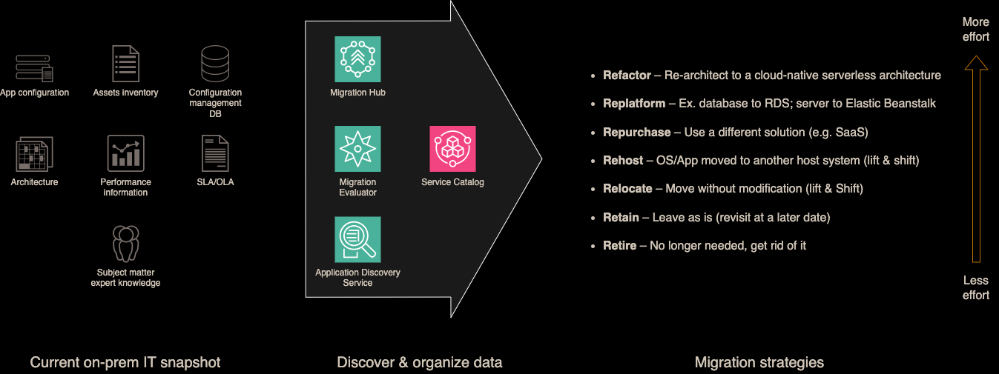
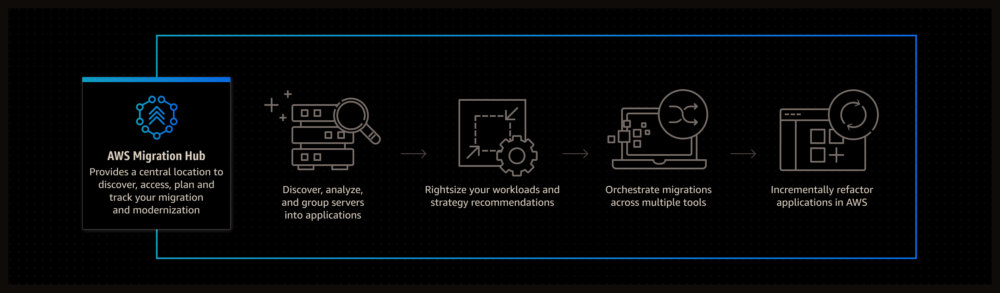
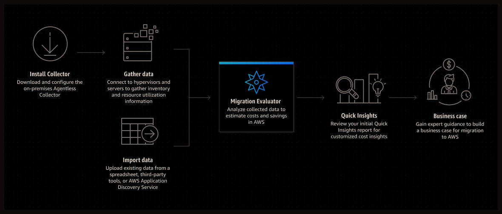
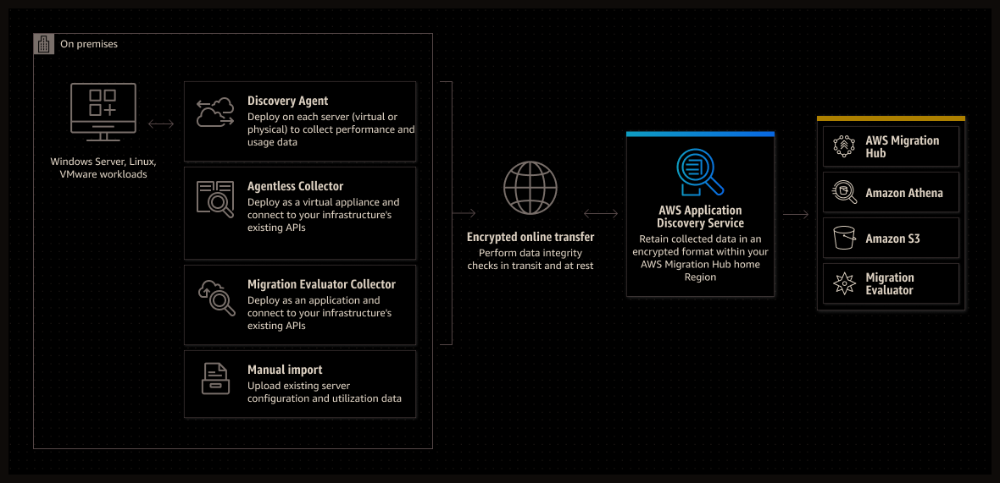

# Cloud Chronicles: 7 Rs of Migration

<figure>

<figcaption>
Generated by Midjourney
</figcaption>
</figure>

&nbsp; <!-- break line -->

Migrating to the cloud can be a complex process, but with the right strategy, it can also be a highly successful one. The 7 Rs of migration offer a framework for this strategy, providing a range of options for moving applications to the AWS Cloud. These strategies build upon the 5 Rs that [Gartner originally identified in 2010](https://www.gartner.com/en/documents/1485116). Before beginning the migration process, it's important to assess your application portfolio data and evaluate it against these 7 Rs: *refactor*, *re-platform*, *repurchase*, *rehost*, *relocate*, *retain*, and *retire*.

After analyzing the portfolio of the on-prem service, a migration plan can be created for each application. It's important to update and optimize this plan regularly based on the feedback and data gathered during the migration process to make it more efficient. The below diagram demonstrates the planning process in detail.

## How to determine what is there to migrate?

To help with this assessment and planning, AWS offers several services that are designed to simplify and streamline the migration process. But before we go there, let's talk about the concepts of the seven Rs as the strategies for migration: *retire*, *retain*, *relocate*, *rehost*, *repurchase*, *re-platform*, and *refactor*.

Here are those approaches explained in detail.

*Retire* – Decommission or remove applications that are no longer needed in your source environment.

*Refactor* (re-architect) – Move an application and modify its architecture by taking full advantage of cloud-native features to improve agility, performance, and scalability. This typically involves porting the operating system and database. Example: Migrate your on-premises Oracle database to the Amazon Aurora PostgreSQL-Compatible Edition.

*Replatform* (lift and reshape) – Move an application to the cloud, and introduce some level of optimization to take advantage of cloud capabilities. Example: Migrate your on-premises Oracle database to Amazon Relational Database Service (Amazon RDS) for Oracle in the AWS Cloud.

*Repurchase* (drop and shop) – Switch to a different product, typically by moving from a traditional license to a SaaS model. Example: Migrate your customer relationship management (CRM) system to Salesforce.com.

*Rehost* (lift and shift) – Move an application to the cloud without making any changes to take advantage of cloud capabilities. Example: Migrate your on-premises Oracle database to Oracle on an EC2 instance in the AWS Cloud.

*Relocate* (hypervisor-level lift and shift) – Move infrastructure to the cloud without purchasing new hardware, rewriting applications, or modifying your existing operations. This migration scenario is specific to VMware Cloud on AWS, which supports virtual machine (VM) compatibility and workload portability between your on-premises environment and AWS. You can use the VMware Cloud Foundation technologies from your on-premises data centers when you migrate your infrastructure to VMware Cloud on AWS. Example: Relocate the hypervisor hosting your Oracle database to VMware Cloud on AWS.

*Retain* (revisit) – Keep applications in your source environment. These might include applications that require major refactoring, and you want to postpone that work until a later time, and legacy applications that you want to retain because there’s no business justification for migrating them.

While all of the 7 Rs can be useful in specific situations, *rehosting*, *re-platforming*, and *refactoring* are generally the most valuable strategies for cloud migration. *Rehosting* can provide immediate cost savings and speed up the migration process, while *re-platforming* can improve application performance and scalability. *Refactoring* can create the most value in the long run, as it involves redesigning the application to fully leverage the benefits of the cloud.

Fortunately, we have not been left alone with those strategic approaches, and Amazon Cloud Services, among several other technologies, provide some tools aimed to help apply those approaches. Let's review them one by one.

I wonder, which do you use?

## AWS Migration Hub

[AWS Migration Hub](https://aws.amazon.com/migration-hub/) is a service offered by AWS that provides a single location for tracking the progress of application migrations. The service can help simplify the planning and execution of migration projects by providing a central dashboard for tracking the progress of migrations across multiple AWS services and partners. It can also help identify any issues that arise during the migration and provide guidance on how to resolve them. With Migration Hub, customers can monitor, manage, and report on the status of their migration projects to AWS.

## AWS Migration Evaluator

The AWS Migration Evaluator is a powerful tool designed to help businesses assess their application portfolios to develop an efficient and effective migration strategy. The tool uses a data-driven approach, which helps you evaluate their current infrastructure and determine the best approach for migrating their applications to the cloud.

The [AWS Migration Evaluator](https://aws.amazon.com/migration-evaluator/) has several approaches that can be used to assess application portfolios. One such approach is the Application Dependency Mapping approach, which provides a visual representation of all the applications that are currently running on-premises. This approach allows companies to understand the dependencies between different applications, which helps them make informed decisions about how to move these applications to the cloud.

Another approach is the Application Readiness Assessment, which would help you determine which applications are ready to be migrated to the cloud. This approach provides businesses with a detailed analysis of each application's technical requirements, including any potential compatibility issues that may arise during the migration process. This approach also provides recommendations for addressing any issues that are identified.

By leveraging this tool, you can apply the 7 Rs of migration to your cloud migration project more effectively.

The first step is to upload your application inventory to Migration Evaluator, which can be done using either AWS Application Discovery Service or an Excel template provided by the tool. Once the data is uploaded, Migration Evaluator analyzes the applications and provides recommendations on which applications are best suited for each migration strategy.

For example, the *retiring* strategy may be recommended for applications that are no longer used or have been replaced by newer versions. The *Retain* strategy may be recommended for applications that cannot be moved to the cloud due to technical or regulatory reasons. The *Rehost* strategy may be recommended for applications that can be easily moved to the cloud with minimal changes.

Migration Evaluator can also provide cost estimates for each migration strategy, which helps in making informed decisions about which strategy to use for each application. By using this tool to apply the 7 Rs of migration, you can create a migration strategy that maximizes value and minimizes risk for your organization.

## AWS Application Discovery Service

The [AWS Application Discovery Service](https://aws.amazon.com/application-discovery/) plays a vital role in the cloud migration process by providing businesses with a comprehensive view of their on-premises applications. This tool uses agents to collect configuration and performance data from on-premises servers and virtual machines. The information collected by the agents is then consolidated in the Application Discovery Service console, giving a complete inventory of existing applications and infrastructure.

The Application Discovery Service offers a wide range of benefits to those seeking to migrate to the cloud. For example, it can help to identify applications that can be migrated to the cloud without the need for modification or *refactoring*, making it easier to develop an effective migration strategy. Additionally, the Application Discovery Service provides data on the dependencies between applications, making it easier to identify applications that need to be migrated together.

The Application Discovery Service is particularly useful for discovering on-premises applications hosted on virtual machines and bare metal. This is because it uses lightweight agents that can be easily deployed to virtual machines and servers, regardless of their location or operating system. Once installed, the agents can collect data on applications running on the machines, including their configuration, usage, and performance metrics. This information is then used to generate reports and recommendations for how to migrate the applications to the cloud.

When considering the 7 Rs of migration, the service can assist in identifying applications that are suitable for each migration approach. For the *retiring* approach, the AWS Application Discovery Service can help identify applications that are no longer being used, allowing for their removal from the migration plan. Similarly, the *retain* approach can be used for applications that are deemed unsuitable for migration to the cloud.

The AWS Application Discovery Service can identify applications that can be moved to another environment without significant changes and provide insights into their dependencies, making it easier to move them to the cloud using the *relocating* approach.

It can identify applications, which require minimal changes to run on AWS, making it easier to *rehost* them to the cloud with minimal effort.

The *repurchase* approach involves purchasing a new cloud-native application to replace an existing one. The AWS Application Discovery Service can provide insights into the functionalities of an application, making it easier to identify suitable replacement options.

The AWS Application Discovery Service can provide insights into the application's architecture and dependencies, making it easier to identify changes to an application to take advantage of cloud-native services applying the *re-platform* strategy.

Finally, the *refactoring* approach involves rewriting an application's code to take advantage of cloud-native services. The AWS Application Discovery Service can provide insights into the application's code and architecture, making it easier to define the changes, which have to be applied.

## AWS Service Catalog

Finally, the [AWS Service Catalog](https://aws.amazon.com/servicecatalog/) provides a centralized location for managing and deploying AWS services, making it easier to manage your migration process. When it comes to cloud migration, AWS Service Catalog can also play a crucial role in implementing the 7 Rs strategies.

For example, when planning a migration to the cloud, you can use AWS Service Catalog to create a catalog of approved IT services that meet your organization's specific needs. The catalog can include pre-approved services for each of the 7 Rs strategies, such as *rehosting*, *re-platforming*, or *refactoring*. This helps ensure that your teams have access to the right IT services to support their migration efforts.

In addition, AWS Service Catalog allows you to manage access to the IT services in your catalog, ensuring that only authorized users can provision and deploy services. This helps maintain security and compliance during the migration process.

## Free Cloud Migration Services on AWS

Once the strategy has been prepared and evaluated, in addition to the AWS services mentioned earlier, there are several other services available to help with the migration process itself. AWS Application Migration Service can help migrate applications to the cloud without making any changes to the application itself. AWS Database Migration Service can migrate databases to the cloud while minimizing downtime. AWS DataSync can be used to transfer large amounts of data to AWS quickly and securely. We can find the list on this AWS website [Free Cloud Migration Services on AWS](https://aws.amazon.com/free/migration/).

---

In conclusion, cloud migration is a complex process that requires careful planning and execution. By following the seven Rs of migration and utilizing AWS services, you can successfully migrate their applications to the cloud and fully leverage the benefits of cloud computing.

When considering a cloud migration, it's important to assess which of the 7 Rs strategies will work best for your organization. You can use AWS services like AWS Migration Evaluator, Application Discovery Service, and Service Catalog to improve the decision-making process. However, you need to remember that the three most valuable strategies for cloud migration are *rehosting*, *re-platforming*, and *refactoring*, as they provide cost savings, performance improvements, and long-term value creation.

Additionally, AWS provides various services to simplify the migration process, such as Application Migration Service, Database Migration Service, and DataSync. Maybe I will cover them in another article when we will be further in the migration process.

By combining these strategies with AWS services, organizations can successfully migrate their applications to the cloud and fully realize the benefits of cloud computing.

What is your experience with migration planning?
