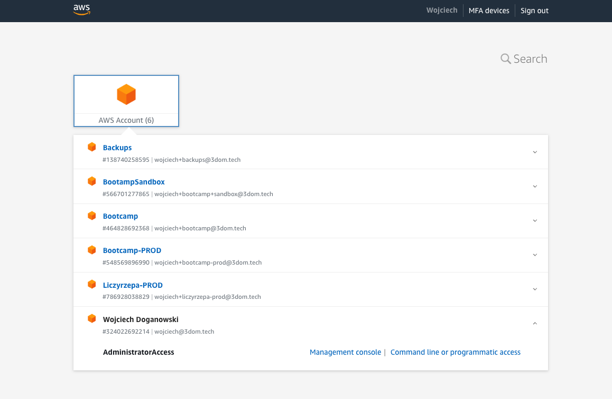

# Easier access to multiple accounts with IAM Identity Center

In this article, I will walk you through setting up the IAM Identity Center, which helps a lot, when you have multiple accounts in your AWS Organisation or you want to be able to log in to AWS using your existing credentials.

IAM Identity Center is a central location where an organization manages its digital identities and access control policies. It provides a single point of control for identity and access management across different systems and applications. AWS Identity and Access Management (IAM) is a web service that provides secure access to AWS services and resources for your users.

SSO (Single Sign-On) is a user authentication service that allows users to use one set of login credentials (username and password) to access multiple applications. 

By using IAM Identity Center as an SSO, you can simplify user management and increase security. IAM Identity Center allows you to control access to AWS resources, such as Amazon S3 and Amazon EC2 instances, and third-party applications, such as Salesforce and Slack.

In this article, I will focus on setting up the IAM Identity Center without using any external identity provider. This is useful in case you want to access multiple accounts using single login but you do not manage the AWS access through your external SSO. In case you want to set up the IAM Identity Center to use your corporate SSO as an identity provider, please follow those AWS instructions: https://docs.aws.amazon.com/singlesignon/latest/userguide/getting-started.html.

## Enable IAM Identity Center

If you have not done it yet, you need to enable the IAM Identity Center. To perform those steps please ensure you are logged in to the AWS Management Console using the root user.

> In AWS, the root user is the initial user account created when an AWS account is set up. This account has full access to all AWS services and resources in the account, and it has complete control over all the users and resources in the account.

1. Sign in to AWS Management Console as the account owner by choosing Root user and entering your AWS account email address.
1. Navigate to the IAM Identity Center by clicking on the _Services_ dropdown in the top left corner, selecting _IAM Identity Center (successor to AWS Single Sign-On)_ under _Security, Identity & Compliance_. Alternatively, you can type _IAM Identity Center (successor to AWS Single Sign-On)_ in the services search prompt.
1. Under _Enable IAM Identity Center_, choose Enable.
1. To use IAM Identity Center, it is necessary to have AWS Organizations. If an organization has not been set up, there is an option to either have AWS create one or to set it up manually. To proceed with the process, select _Create AWS organization_.

Upon setting up AWS Organizations, email verification is automatically sent to the email address associated with the management account. It's important to note that there may be a delay in receiving the verification email. It is recommended to verify the email address within 24 hours of receiving the email.

## AWS Organizations

AWS Organizations is a service provided by Amazon Web Services (AWS) that enables centralized management of multiple AWS accounts. It allows an organization to consolidate billing and manage access control policies across multiple AWS accounts.

With AWS Organizations, an administrator can create and manage groups of AWS accounts, known as _organizational units_ (OUs). Each OU can have its own policies and service control policies (SCPs), which are used to restrict access to AWS services and APIs.

AWS Organizations simplifies billing by allowing an organization to consolidate all the AWS accounts under a single payment method. This means that all AWS charges for an organization's accounts are billed to a single account, rather than multiple accounts.

AWS Organizations also make it easier to manage access control and compliance by enabling administrators to apply policies across multiple AWS accounts. Administrators can apply policies at the OU level to restrict access to specific services or APIs, or to enforce compliance requirements.

## Choosing the identity source

In the next step, you should choose the identity provider (IdP) for your organization. Upon enabling IAM Identity Center for the first time, it automatically sets up an Identity Center directory as the default identity source. This directory is where users and groups are created and access levels are assigned to AWS accounts and applications.

If you are currently managing users and groups in Active Directory or an external identity provider, it's recommended that you connect this identity source when enabling IAM Identity Center and selecting your identity source. This should be done before creating any users and groups in the default Identity Center directory or making any assignments.

It's important to note that if you're already managing users and groups in one identity source within IAM Identity Center and decide to change to a different identity source, all user and group assignments that were previously configured in IAM Identity Center may be removed. This would result in all users, including the administrative user in IAM Identity Center, losing single sign-on access to their AWS accounts and applications.

To avoid this issue, it's crucial to carefully consider the implications of changing your identity source and to review the considerations for doing so. For more information, please refer to the relevant documentation mentioned above. I'm not covering those cases in this article. I will assume you are using the Identity Center directory as the identity provider.

## Creating administrative permissions

In IAM Identity Center, permission sets define a collection of permissions that determine what actions a user can perform in AWS accounts and applications. Permission sets simplify the process of granting access to AWS resources by allowing administrators to assign a set of predefined permissions to a user or group of users.

There are two types of permission sets in IAM Identity Center:

1. AWS Managed Permission Sets: These are predefined sets of permissions created and maintained by AWS. These sets are designed to grant access to common AWS services and resources.
1. Custom Permission Sets: These are sets of permissions created by an administrator to meet the specific needs of their organization. Custom permission sets can be created by selecting specific permissions from a list of available permissions, or by copying an existing permission set and modifying it as needed.

Both AWS Managed and Custom Permission Sets can be assigned to users or groups of users, allowing them to access the AWS accounts and applications associated with the assigned permissions. To have administrative access to our accounts, we need to create the AdministratorAccess predefined permission set following the steps:

1. In the IAM Identity Center console click on _Permission sets_ in the left-hand menu.
1. Click on the _Create new permission set_ button in the upper right-hand corner of the page.
1. Select _Predefined permission set_ as the type of permission set.
1. Select _AdministratorAccess_ as the predefined permission set to create.
1. Enter a name and description for the permission set, if desired.
1. Review the details of the permission set, and click the _Create_ button.

The AdministratorAccess permission set is now created and can be assigned to users or groups of users, providing them with full administrative access to the AWS accounts and applications associated with the permission set.

## Creating users in the IAM Identity Center

We will now complete the following steps to create the administrative user in IAM Identity Center.

1. In the IAM Identity Center console select _Users_.
1. Chose _Add user_ and provide requires information.
1. In the _User details_ section, enter the user's first name, last name, and email address.
1. In the _Assign user to groups_ section, select the groups to which you want to add the user. Select the _AdministratorAccess_ group created in the previous step.
1. Review the user details and group and access assignments, and click the _Create user_ button.

The new user will receive an email invitation to activate their account and set their password. Once they have activated their account, you can sign in to the AWS Management Console and access the accounts and applications to which they have been granted access. But first, let's add the accounts to this user.

## Adding accounts to the administrative user

To be able to log in to desired accounts, which are part of your organization, you need to assign them to the user. Let's assume we will be using the administrative user created in the previous step.

Here are the steps to set up AWS account access for an administrative user in IAM Identity Center:

1. In the IAM Identity Center console click on _AWS Accounts_ in the left-hand menu.
1. You should be presented with the list of the accounts as presented in the following picture.

1. Select the accounts you want to access.
1. Press _Assign users and groups_ and select the _Users_ tab.
1. Select the administrative user and press _Next_.
1. Select the AdministratorAccess permission set and press _Next_.
1. Review and press _Submit_.

The administrative user now has access to the added AWS accounts through IAM Identity Center. To access the account using the just established Identity Center directory you need to copy the  AWS access portal URL from the Dashboard page of the IAM Identity Center. It will look similar to this: https://my-sso-portal.awsapps.com/start. When you open the URL in your browser, you will be asked to log in and later you will be presented with an account switcher as shown in the following image:

---

Thanks to this method, you can use one credential to administrate multiple accounts in your AWS Organization. Having multiple accounts in AWS can be useful for several reasons:

Cost Management: Multiple accounts can help you manage costs by allowing you to track spending on a per-account basis. This can be especially useful for organizations with multiple departments or teams.

Compliance: Some compliance requirements may require that you keep certain data or workloads in separate accounts to maintain compliance.

Scalability: Multiple accounts can provide better scalability by allowing you to isolate workloads and scale them independently. This can help ensure that one workload does not impact the performance of another.

Simplified IAM Management: By using multiple accounts, you can simplify IAM management by creating smaller, more focused policies and roles. This can help reduce complexity and make it easier to manage permissions for different teams and workloads.
