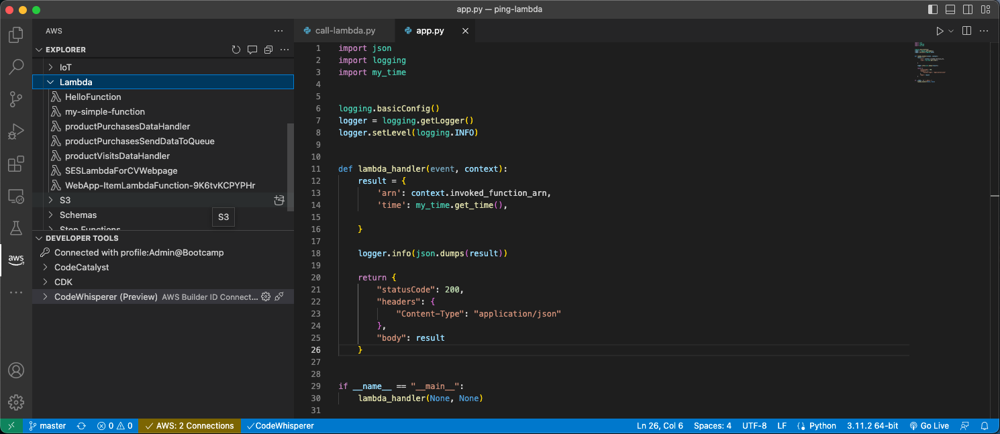

# Using Visual Studio Code for CLI and Python tasks on AWS - part 2 - AWS CLI



In the first part of this article [Using Visual Studio Code for CLI and Python tasks on AWS - part 1](../01.%20Using%20VSCode%20for%20CLI%20and%20Python%20tasks%20on%20AWS%20-%20part%201/README.md) I have covered the installation of Python3 and Visual Studio Code. Now we will focus on the installation of AWS CLI. Thanks to this, we will be able to connect to AWS resources from our local machine.

## AWS CLI

The AWS CLI (Command Line Interface) is a powerful tool for managing your AWS resources and services through a command-line interface. It allows you to interact with AWS resources using commands in your terminal (or Command Prompt on Windows) rather than using the AWS Management Console or SDK.

The AWS CLI can be useful in a variety of scenarios, including:

Automating repetitive tasks: If you have to perform the same AWS-related tasks regularly, you can use the AWS CLI to automate these tasks by writing scripts that perform the required actions.

Developing and testing applications: Developers can use the AWS CLI to test and deploy their applications using scripts or automation tools. This can help streamline the development and deployment process.

Managing AWS resources in a serverless environment: The AWS CLI is especially useful for managing AWS resources in a serverless environment, where you might be creating and deploying Lambda functions, API Gateway, S3 buckets, and other serverless components using the AWS CLI.

Managing AWS resources across multiple accounts and regions: With the AWS CLI, you can manage AWS resources across multiple accounts and regions using a single tool, making it easy to automate and manage complex AWS environments.

Integrating with other tools and services: The AWS CLI can be integrated with other tools and services, such as Jenkins, Git, and Docker, to automate the deployment and management of AWS resources in these environments.

### Install AWS CLI on macOS

If you have _sudo_ permissions, you can install the AWS CLI for all users on the computer:

```sh
curl "https://awscli.amazonaws.com/AWSCLIV2.pkg" -o "AWSCLIV2.pkg"
sudo installer -pkg AWSCLIV2.pkg -target /
```

In case you are not able to do this, you can follow the instructions from AWS: https://docs.aws.amazon.com/cli/latest/userguide/getting-started-install.html.

### Install AWS CLI on Ubuntu

Just run:

```sh
sudo apt install awscli
```

### Install AWS CLI on Windows

Download the MSI installer from the official website: https://aws.amazon.com/cli/ and run the installer. Make sure to select _Add Python to environment variables_ during the installation process.

## Configure AWS access

Before we can use AWS CLI we need to set up the necessary configuration settings to communicate with the AWS services. There are two methods of achieving this. First is to use the _access key ID_ and _secret access key_, however this is not recommended anymore. Instead, we can enable authentication through a user in IAM Identity Center.

### Configuring AWS access using IAM Identity Center (recommended)

To configure AWS CLI to authenticate through a user in IAM Identity Center, you need to have to enable access through the IAM Identity Center. You can follow my article [Easier access to multiple accounts with IAM Identity Center](../../02.%20Easier%20access%20to%20your%20accounts%20with%20IAM%20Identity%20Center/README.md).

#### Creating PowerUser

Once you established access through IAM Identity Center, you can follow these steps:

1. Log in to the AWS Management Console using your AWS account credentials. If you have multiple accounts, ensure you are logging into your management account using the root user.
1. Navigate to the IAM Identity Center by clicking on the _Services_ dropdown in the top left corner, selecting _IAM Identity Center (successor to AWS Single Sign-On)_ under _Security, Identity & Compliance_. Alternatively, you can type _IAM Identity Center_ in the services search prompt.
Create a new permission set that grants PowerUserAccess permissions:
    1. Click on the _Create new permission set_ button in the upper right-hand corner of the page.
    2. Select _Predefined permission set_ as the type of permission set.
    3. Select _PowerUserAccess_ as the predefined permission set to create.
    4. Enter a name and description for the permission set, if desired.
    5. Review the details of the permission set, and click the _Create_ button.
1. Assign the newly created user to the account:
    1. Click on _AWS accounts_ in the left panel. You should be presented with the list of the accounts. 
    2. Select the accounts you want to access.
    3. Press _Assign users and groups_ and select the _Users_ tab.
    4. Select the desired user and press _Next_.
    5. Select the PowerUserAccess permission set and press _Next_.
    6. Review and press _Submit_.

> Unlike the administrative permission set, which uses AdministratorAccess permissions, the PowerUserAccess permission set doesn't allow management of users and groups.

#### Configuring the profile with the AWS configure SSO wizard

Once we have the user with PowerUserAccess permissions created, you can configure the AWS CLI using the following commands:

```sh
$ aws configure sso 
SSO session name (Recommended): my-sso
SSO start URL [None]: https://my-sso-portal.awsapps.com/start
SSO region [None]: eu-north-1
SSO registration scopes [None]: sso:account:access
Attempting to automatically open the SSO authorization page in your default browser.
If the browser does not open or you wish to use a different device to authorize this request, open the following URL:

https://device.sso.eu-north-1.amazonaws.com/

Then enter the code:
```

You will see your browser opening and you will need to log in to your PowerUserAccess account. Then you will need to allow CLI (called botocore-client) to access AWS IAM Identity Center accounts and permission sets.


After this, you will be presented with the account, to which you want to log in to your AWS CLI. You need to select one.

```sh
SQTM-CXXB
There are 6 AWS accounts available to you.
> Bootcamp (123456789011)                 
  Bootcamp-PROD (123456789012)       
  Backups (123456789013)                   
  BootcampSandbox (123456789014)   
  Wojciech Doganowski (123456789015)               
  Liczyrzepa-PROD (123456789016)   
```

After selecting the account, you will be prompted to which region you want the CLI to be logged in:

```sh
Using the account ID 123456789011
The only role available to you is: PowerUserAccess
Using the role name "PowerUserAccess"
CLI default client Region [None]: eu-north-1
CLI default output format [None]: YAML
CLI profile name [PowerUserAccess-123456789011]:

To use this profile, specify the profile name using --profile, as shown:

aws s3 ls --profile PowerUserAccess-123456789011
$
```

That's it! You have now configured AWS CLI to authenticate through a user in IAM Identity Center using access keys. Let's try to access S3:

```sh
$ aws s3 ls --profile PowerUserAccess-123456789011
2023-04-01 19:24:29 python-session-1-dogan
```

This results in creating the sso-session section and named profile in ~/.aws/config that looks like the following:

```sh
[profile PowerUserAccess-123456789011]
sso_session = my-sso
sso_account_id = 123456789011
sso_role_name = PowerUserAccess
region = eu-north-1

[sso-session my-sso]
sso_start_url = https://my-sso-portal.awsapps.com/start
sso_region = eu-north-1
sso_registration_scopes = sso:account:access
```

#### Logging in with IAM Identity Center

To be able to use the AWS CLI next time, you will need to login to SSO using the following command:

```sh
aws sso login --profile PowerUserAccess-123456789011
```

You will be asked to login into the browser window again, the same way as while creating the SSO account.

To avoid adding _--profile PowerUserAccess-123456789011_ to each AWS CLI command, you can set the AWS_PROFILE variable in the following way:

On Linux or Mac:

```sh
export AWS_PROFILE=PowerUserAccess-123456789011
```

On Windows:

```sh
SET AWS_PROFILE=PowerUserAccess-123456789011
```

Then you can run AWS CLI commands like this:

```sh
$ aws s3 ls
2023-04-01 19:24:29 python-session-1-dogan
```

To logout the AWS CLI session, you need to use:

```sh
aws sso logout
```

You have configured the AWS CLI to use the IAM Identity Center as the SSO.

### Configuring AWS access using the access key (not recommended option)

> It's important to note that the _access key ID_ and _secret access key_ are sensitive information that should be kept secure. For that reason, we should avoid using them as if someone will get the access to this key pair, would have the same access to your account as you.

Following are the steps to get the _access key ID_ and _secret access key_:

1. Log in to the AWS Management Console using your AWS account credentials.
1. Open the IAM console.
1. In the navigation pane, choose _Users_.
1. Select your IAM user name.
1. Choose the _Security credentials_ tab.
1. Expand the _Access keys_ section.
1. Choose the _Create access key_ button.
1. Select _Command Line Interface (CLI)_.
1. Download and save the access key file.
1. Use the access key ID and secret access key from the file to complete the _aws configure_ command.

> Note that you should treat your access key ID and secret access key as sensitive information and keep them secure. Do not share them with others, and rotate them regularly to ensure the security of your AWS account.

Configure the AWS CLI: Run the following command in the terminal or command prompt window: _aws configure_. This will launch a wizard that will guide you through the process of configuring the AWS CLI:

```sh
$ aws configure
AWS Access Key ID [None]: ********************
AWS Secret Access Key [None]: ********************
Default region name [None]: us-east-1
Default output format [None]: YAML
```

1. Enter your AWS _access key ID_ and _secret access key_: you will need to enter your access key ID and secret access key, which you have obtained from the AWS Management Console.
1. Choose your default region: You will need to choose a default region for the AWS CLI. This is the region that the CLI will use by default for all AWS services.
1. Choose your default output format: You will need to choose a default output format for the AWS CLI. This is the format that the CLI will use to display output from AWS services. You can choose between JSON and YAML or leave it empty, to let AWS decide.

### Testing the CLI

Test the AWS CLI: Once the AWS CLI is configured, you can test it by running a command such as _aws s3 ls_. This will list the contents of your default S3 bucket (assuming you have one).

```sh
$ aws s3 ls
2023-04-01 19:21:39 python-session-1-dogan
```

Great, we have the development IDE and the AWS CLI installed.

---

Up to now, we have the Python and Visual Studio Code installed together with AWS CLI. In the next part of this article - [Using Visual Studio Code for CLI and Python tasks on AWS - part 3](../03.%20Using%20VSCode%20for%20CLI%20and%20Python%20tasks%20on%20AWS%20-%20part%203/README.md) - we will install the Boto3 library.
