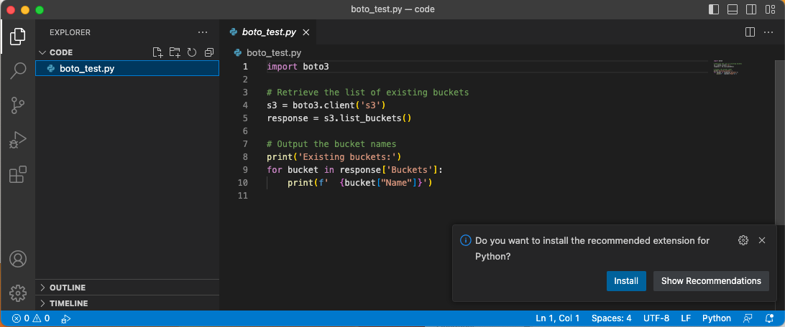
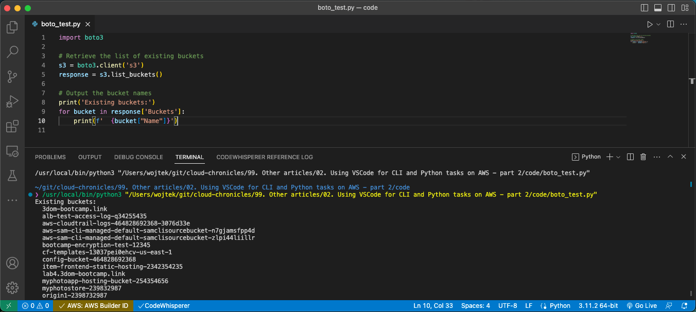

# Using Visual Studio Code for CLI and Python tasks on AWS - part 3 - Boto3


In the first part of this article [Using Visual Studio Code for CLI and Python tasks on AWS - part 1](../01.%20Using%20VSCode%20for%20CLI%20and%20Python%20tasks%20on%20AWS%20-%20part%201/README.md) I have covered the installation of Python3 and Visual Studio Code. In the second part [Using Visual Studio Code for CLI and Python tasks on AWS - part 2](../02.%20Using%20VSCode%20for%20CLI%20and%20Python%20tasks%20on%20AWS%20-%20part%202/README.md) I have covered the installation and configuration of AWS CLI. Now let's install the Boto3 library, so we will be able to connect to AWS resources from Python code.

## AWS SDK for Python (Boto3)

Boto3 is the AWS Software Development Kit (SDK) for Python, which allows developers to write Python scripts to interact with AWS services programmatically. Here are some of the main use cases for Boto3:

Automating AWS infrastructure: Boto3 can be used to automate the creation, modification, and deletion of AWS resources, such as EC2 instances, S3 buckets, and RDS databases. This can save time and reduce errors that can occur when creating and managing resources manually.

Data processing and analysis: Boto3 can be used to retrieve data from AWS services, such as S3, DynamoDB, and Kinesis, and process it using Python libraries and tools, such as NumPy and Pandas. This can be useful for performing data analysis, machine learning, and other tasks that require processing large amounts of data.

DevOps automation: Boto3 can be used to automate tasks related to DevOps, such as deploying code to AWS services using tools like CodeDeploy and CodePipeline. This can streamline the deployment process and reduce the time and effort required to deploy code to AWS.

Cloud management and monitoring: Boto3 can be used to manage and monitor AWS services, such as CloudWatch, CloudFormation, and AWS Config. This can help ensure that AWS resources are running smoothly and within expected parameters and can help identify issues before they become critical.

### Install Boto3 on macOS

On macOS, if you followed the Python installation steps from the link provided above, you will have already installed the _pip3_ package manager, so we just need to run the following command:

```sh
pip3 install boto3
```

It will install the Boto3 library.

### Install Boto3 on Ubuntu

To install Boto3 on Linux, we need to install the _pip3_ explicitly unless you have installed it already before. In the VSCode terminal window run:

```sh
sudo apt-get install python3-pip
pip3 install boto3
```

Above code will install the _pip3_ package manager and then the Boto3 library.

### Install Boto3 on Windows

In the case of Windows, the process is similar to macOS and the _pip3_ package manager should come together with Python installation. Just run:

```sh
pip3 install boto3
```

OK, we have the CLI and Boto3 installed, we just need to test Boto3 in a real application. Create a new Python file named _boto_test.py_ by selecting from _File_ menu _New File..._ and copy the following code to the window on the right side:

```python
import boto3

# Retrieve the list of existing buckets
s3 = boto3.client('s3')
response = s3.list_buckets()

# Output the bucket names
print('Existing buckets:')
for bucket in response['Buckets']:
    print(f'  {bucket[_Name_]}')
```

You should be asked to install the Python extension of Visual Studio Code. This is a good moment to do it, as we will need it to be able to run the Python code within the Visual Studio Code IDE. Just press install and after the installation is finished, close the _Extension: Python_ file, which will open.



Then save the file by selecting _Save_ from the _File_ menu and we are ready to run it by selecting _Run Without Debugging_ from _Run_ menu. You should see something similar to this:



Remember to log in to AWS SSO, otherwise, you will receive the following error:

```sh
botocore.exceptions.SSOTokenLoadError: Error loading SSO Token: Token for my-sso does not exist
```

---

Up to now, we have the Python and Visual Studio Code installed together with two methods to access the AWS resources: AWS CLI and the Boto3 library. In the next part of this article - [Using Visual Studio Code for CLI and Python tasks on AWS - part 4](../04.%20Using%20VSCode%20for%20CLI%20and%20Python%20tasks%20on%20AWS%20-%20part%204/README.md) - we will add some fun extensions, which maybe are not crucial, but help in the daily tasks.
