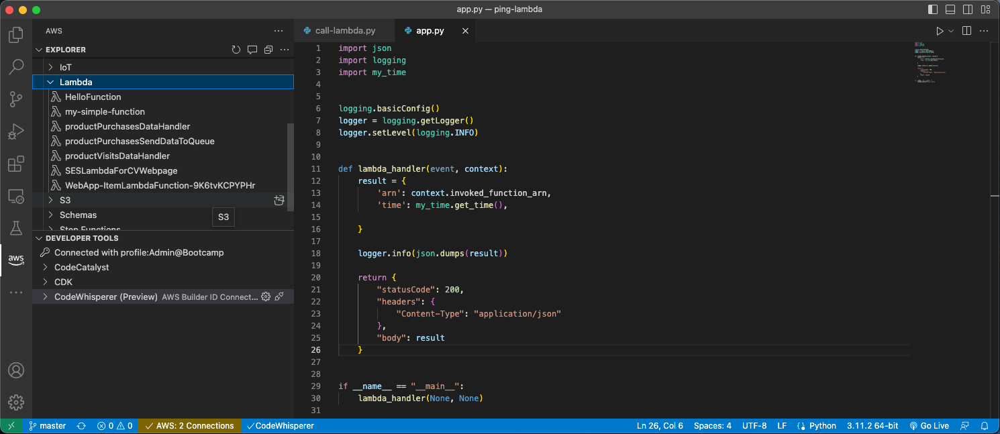
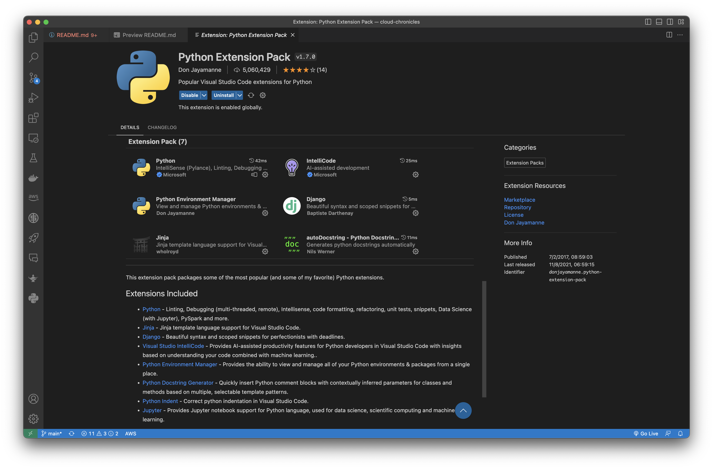
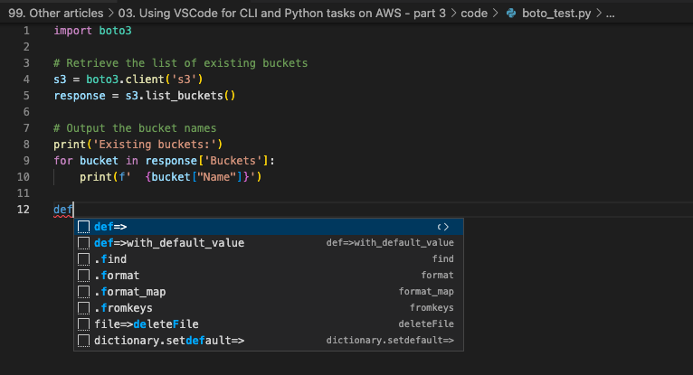
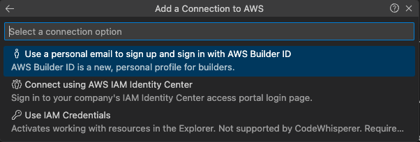
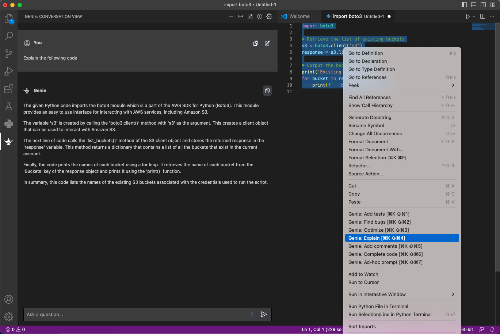

# Using Visual Studio Code for CLI and Python tasks on AWS - part 4 - VSCode extensions

In the first part of this article [Using Visual Studio Code for CLI and Python tasks on AWS - part 1](../01.%20Using%20VSCode%20for%20CLI%20and%20Python%20tasks%20on%20AWS%20-%20part%201/README.md) I have covered the installation of Python3 and Visual Studio Code. In the second part [Using Visual Studio Code for CLI and Python tasks on AWS - part 2 - CLI](../02.%20Using%20VSCode%20for%20CLI%20and%20Python%20tasks%20on%20AWS%20-%20part%202/README.md) I have covered the installation and configuration of AWS CLI. In the third part [Using Visual Studio Code for CLI and Python tasks on AWS - part 3 - Boto3](../03.%20Using%20VSCode%20for%20CLI%20and%20Python%20tasks%20on%20AWS%20-%20part%203/README.md) I have covered the installation of the Boto3 library. Finally, let's add some useful extensions.

## Visual Studio Code extensions

The Visual Studio Code extensions provide a powerful way to customize and enhance VS Code for specific programming languages, workflows, and development environments.

I suggest installing the [Python Extension Pack](https://marketplace.visualstudio.com/items?itemName=donjayamanne.python-extension-pack), which is a collection of extensions for Visual Studio Code that is focused on Python development. The extension pack includes several popular extensions for Python developers, such as:

1. Python - Linting, Debugging (multi-threaded, remote), Intellisense, code formatting, refactoring, unit tests, snippets, Data Science (with Jupyter), PySpark, and more.
1. Jinja - Jinja template language support for Visual Studio Code.
1. Django - Beautiful syntax and scoped snippets for perfectionists with deadlines.
1. Visual Studio IntelliCode - Provides AI-assisted productivity features for Python developers in Visual Studio Code with insights based on understanding your code combined with machine learning.
1. Python Environment Manager - Provides the ability to view and manage all of your Python environments & packages from a single place.
1. Python Docstring Generator - Quickly insert Python comment blocks with contextually inferred parameters for classes and methods based on multiple, selectable template patterns.
1. Python Indent - Correct Python indentation in Visual Studio Code.
1. Jupyter - Provides Jupyter notebook support for Python language, used for data science, scientific computing, and machine learning.

As you can see the Python Extension Pack provides a convenient way for Python developers to quickly set up a productive development environment in Visual Studio Code

## Installing Python Extension Pack

To install the Python Extension Pack in Visual Studio Code, you can follow these steps:

1. In Visual Studio Code click on the _Extensions_ icon on the left-hand side of the window, or press Ctrl+Shift+X (Windows/Linux) or Cmd+Shift+X (macOS) to open the Extensions view.
1. In the search bar, type _Python Extension Pack_ and press Enter.
1. The extension pack should appear in the search results. Click on the _Install_ button to install it.
1. After installation, you may be prompted to reload VSCode for the changes to take effect. If so, click on the _Reload_ button.

That's it! The Python Extension Pack is now installed and ready to use in Visual Studio Code. You can start using the Python-specific features and functionality provided by the extensions included in the pack.

## Installing autopep8 extension

The _autopep8_ extension for Visual Studio Code is a tool that automatically formats Python code to conform to the PEP8 style guide described here https://peps.python.org/pep-0008/. 

PEP8 is a set of guidelines for writing Python code that was developed by Guido van Rossum, the creator of Python, along with other Python developers. PEP stands for _Python Enhancement Proposal_, and PEP8 is one such proposal that was created to provide a consistent and standardized approach to writing Python code.

PEP8 covers a wide range of topics related to Python code style, including indentation, line length, naming conventions, comments, and more. The guidelines are designed to make Python code more readable and easier to understand, both for the original author and for other developers who may need to work with the code in the future.

Following the PEP8 guidelines is not mandatory, but it is considered a best practice for Python development. Adhering to the guidelines can help improve the readability and maintainability of your code, and can make it easier for other developers to collaborate with you on your projects. There are also many tools and extensions available that can automatically check your code for PEP8 compliance, such as the _pycodestyle_ and _flake8_ tools.

When you open a Python file in Visual Studio Code and save it, the _autopep8_ extension automatically formats the code in accordance with the pep8 style guide. This includes things like indentations, spacing, line breaks, and more.

To install the autopep8 in Visual Studio Code, you can follow these steps:

1. In Visual Studio Code click on the _Extensions_ icon on the left-hand side of the window, or press Ctrl+Shift+X (Windows/Linux) or Cmd+Shift+X (macOS) to open the Extensions view.
1. In the search bar, type _autopep8_ and press Enter.
1. The extension pack should appear in the search results. Click on the _Install_ button to install it.

Using the _autopep8_ extension can help ensure that your Python code is consistent, easy to read, and conforms to best practices. It can also save you time by automating the process of formatting your code. To format the document using autopep8, you can do this by using the context menu (right-click on an open Python file in the editor) and selecting _Format Document_ With..._.

## Installing Python Snippets Pack

The _Python Snippets Pack_ is a collection of pre-written code snippets that can be used in Python programming. These snippets are designed to save time and effort when writing Python code, as they provide templates or examples of commonly used code patterns or functions.

Once installed, the extension provides a collection of Python snippets that can be accessed through the Visual Studio Code editor's IntelliSense feature.

Some examples of snippets included in the Python Snippets Pack are:

_for_ loop: Creates a basic for loop structure.
_if_ statement: Creates a basic if/else statement structure.
_try_ statement: Creates a basic try/except statement structure.
_function_: Creates a basic function definition structure.

Using these snippets can save time and reduce the amount of typing required when writing Python code, especially for common code patterns that are used frequently.

To install the Python Snippets Pack in Visual Studio Code, you can follow these steps:

1. In Visual Studio Code click on the _Extensions_ icon on the left-hand side of the window, or press Ctrl+Shift+X (Windows/Linux) or Cmd+Shift+X (macOS) to open the Extensions view.
1. In the search bar, type _python snippets_ and press Enter.
1. The extension pack should appear in the search results. Click on the _Install_ button to install it.

## Installing AWS extension

The AWS Toolkit for Visual Studio Code is an extension that provides a set of tools and features for developing, testing, and deploying applications on Amazon Web Services (AWS) from within the VSCode editor. The extension enables developers to work with a wide range of AWS services, including Lambda, DynamoDB, S3, and more.

Some of the key functionalities provided by the AWS Toolkit for VSCode include:

Create, configure, and deploy AWS resources: The extension provides wizards and templates to help you create and configure AWS resources, such as Lambda functions, API Gateway endpoints, and DynamoDB tables, directly from within the VSCode editor. You can also deploy your applications to AWS from within the editor, without having to switch to the AWS Management Console.

Debug AWS applications: The extension enables you to debug your AWS applications locally or remotely using the VSCode debugger. You can set breakpoints, inspect variables, and step through code as it executes on AWS.

Manage AWS credentials: The extension makes it easy to manage your AWS credentials and profiles directly from within the VSCode editor. You can configure multiple AWS profiles and easily switch between them as needed.

Monitor AWS resources: The extension provides real-time monitoring and logging of your AWS resources, allowing you to quickly identify and troubleshoot issues.

Work with AWS CDK: The extension supports AWS Cloud Development Kit (CDK), a framework for defining cloud infrastructure using code. You can use the extension to generate, deploy, and manage CDK applications directly from within VSCode.

To install the AWS Toolkit in Visual Studio Code, you can follow these steps:

1. In Visual Studio Code click on the _Extensions_ icon on the left-hand side of the window, or press Ctrl+Shift+X (Windows/Linux) or Cmd+Shift+X (macOS) to open the Extensions view.
1. In the search bar, type _aws toolkit_ and press Enter.
1. The extension pack should appear in the search results. Click on the _Install_ button to install it.
1. Select the _AWS_ icon from the left menu.
1. In the AWS Explorer choose to _Select a connection..._ and then follow the instructions.

In case you followed the instruction from [Using Visual Studio Code for CLI and Python tasks on AWS - part 2 - AWS CLI](../02.%20Using%20VSCode%20for%20CLI%20and%20Python%20tasks%20on%20AWS%20-%20part%202/README.md), you can use the IAM Identity Center user you created before. Otherwise, if you have decided to use the key pair, you can select the IAM credentials. 

There is also one more option to use the AWS Builder ID, which I do not cover here.

Once connected, you can explore the AWS resources in the AWS Explorer panel.

## Installing Genie AI - ChatGPT

The _Genie AI_ extension for Visual Studio Code is a tool that provides AI-powered code completions and suggestions based on the context of your code. It uses machine learning algorithms to analyze your code and provide relevant suggestions for code completion, helping you to write code faster and with fewer errors.

The Genie AI extension uses a deep learning model to understand the semantics of your code, and it can provide code completions for a wide range of programming languages, including Python, JavaScript, TypeScript, and more. It can also suggest code snippets and templates based on your current code, making it easier to write code that follows best practices and design patterns.

To use the Genie AI extension, you need to have an API key, which can be obtained by signing up for an Open AI account. The key can be generated here https://platform.openai.com/account/api-keys. When you try to use the extension the first time, it will prompt for the API key and once it has been provided, you can install the extension in Visual Studio Code and configure it to use your API key. The extension will then start providing code completions and suggestions as you write code in your preferred programming language.

The Genie AI extension has several use cases:

1. Code completion: Genie AI uses machine learning algorithms to analyze your code and provide relevant suggestions for code completion. This can help you write code faster and with fewer errors.
2. Code generation: Genie AI can suggest code snippets and templates based on your current code, making it easier to write code that follows best practices and design patterns.
3. Debugging assistance: Genie AI can assist with debugging code, by identifying errors and suggesting fixes.
4. Documentation: Genie AI can suggest documentation for code elements, such as functions or classes, making it easier to understand how to use them.
5. Refactoring: Genie AI can suggest ways to improve your code, such as by identifying duplicated code or suggesting better variable names.
6. Learning: Genie AI can help developers learn new programming concepts and techniques by providing relevant code examples and explanations.

Overall, the Genie AI extension can help you save time and improve the quality of your code by providing intelligent code suggestions and assistance within the VSCode editor.

---

Now you can work with Visual Studio Code to learn AWS and Python. I hope this environment works for you and will be very useful. You can try developing and deploying Python applications to AWS e.g. Lambda functions. Serverless architectures are becoming increasingly popular, and VSCode has excellent support for Lambda functions and other serverless services on AWS.

I suggest you explore further, e.g. by adding AWS Serverless Application Model (SAM) CLI. It is an open-source framework that allows developers to easily build and deploy serverless applications on AWS, using AWS Lambda, Amazon API Gateway, Amazon DynamoDB, and other services. SAM provides a simplified way of defining the resources needed for your application, including APIs, database tables, and event sources, as well as the code for your Lambda functions. With SAM, you can test your serverless applications locally before deploying them to AWS, and you can use popular tools like Visual Studio Code for development and debugging.

Keep exploring.
