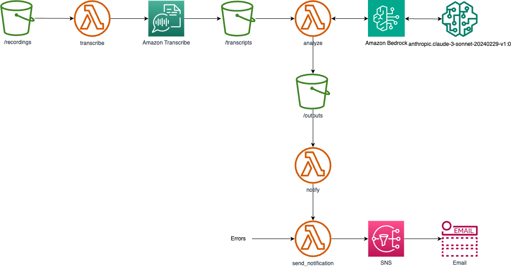

# Transforming Call Center Analytics with AWS Bedrock


Generated by DALL-E 3 and enhanced with Adobe Photoshop

## Introduction

In the dynamic and customer-centric world of call centers, analyzing and improving call scripts is crucial for enhancing sales conversions. The Go3 OTT video service, which operates across the Baltic countries of Lithuania, Latvia, and Estonia, faced not a unique challenge: their call center needed to review calls made in multiple languages to provide consistent and effective guidelines to their agents. To address this, an AWS-based application was developed leveraging AWS Bedrock to analyze and translate call transcripts, ensuring that the Go3 call center can maintain high-quality interactions and boost sales performance.

## Problem Statement

The Go3 call center handles a diverse range of customer inquiries across different languages. The call center manager required a solution that could analyze calls in real-time, translate the transcripts, and provide actionable insights to improve call scripts. The primary challenges included:

- Multilingual support for call transcription and translation.
- Accurate analysis of call content to derive meaningful insights.
- Seamless integration with existing call center operations.

The goal was to create an application that could automate the transcription and translation process, enabling the manager to review calls and refine the call scripts to enhance sales conversion rates.

## Solution Approach

To tackle these challenges, we leveraged several AWS services, including AWS Bedrock, to build a robust solution. The key components of the application included:

- **Amazon S3**: For storing the call audio files and transcripts.
- **AWS Lambda**: For orchestrating the process.
- **Amazon Transcribe**: For creating the transcribe of the call recordings.
- **Amazon Bedrock**: To analyze and translate the transcribed text.
- **Simple Notification Service**: To send out the call analysis.

This combination of services allowed us to create a scalable and efficient system capable of handling the Go3 call center’s requirements.

## Application Architecture

The architecture of the solution is designed to be modular and scalable, leveraging AWS services to their full potential. Here’s a high-level overview of the architecture:

1. **Audio Storage**: Call audio files are stored in an S3 bucket in `recordings` directory.
2. **Transcription**: When a new audio file is uploaded, an S3 event triggers a Lambda function that initiates the transcription process, which result is stored on S3 bucket in `transcribed` directory.
3. **Translation and Analysis**: When the transcribed text is uploaded, the S3 event triggers Lambda again, which initaites the AWS Bedrock to convert it into the desired language and analyze the content. The result is saved on S3 in `output` directory.
4. **Sendoutout of Result**: The the results are uploaded, again the S3 event triggers the Lambda, which sends out the result to the SNS topic.
5. **Review**: The translated transcript and analysis results are sent out by the email for the review.

The architecture of the solution is presented on the below diagram.



Note that there are potentially two possible solution, to use use bucket for all the operations, or to use one bucket per operation. The first solution makes it cleaner regarding the S3 resources (only single bucket is created for the application), however due to limitations of the S3 events, it can work only with one Lambda function, which has to perform all the tasks, depending on the directory, in which the file is created.

Other solution would be to use several buckets and seperate Lambda for each operation. It would be cleaner from the Lambda code stand point, but as this is hidden from the user, I have decided to use a single bucket approach. 

In the above diagram, tehere are three instances of the bucket and lambda, however they are all implemented as one bucket with several directories and one Lambda with the handler dispathing the requests.

## Example of Result

Here is an example of the email containing the result of the process:

```txt
1. Sentiment and Quality Analysis:

The conversation seems to be a call from a customer service agent trying to assist a customer who had registered on the Go3 platform but did not complete the process fully. The agent is polite and professional, informing the customer about call recording and trying to understand the issue. However, the customer appears uninterested and dismissive, providing short responses indicating they do not need any assistance. The customer sentiment seems neutral to slightly negative, while the agent maintains a positive and helpful tone throughout the interaction.

2. Speaker Analysis:

Based on the conversation, it appears that spk_1 is the agent from Go3, and spk_0 is the customer who registered on the platform.

3. Translated Conversation:

0.93    Customer: Hello
1.98    Agent: Hello, greetings? This is Nore calling from Go3 regarding your registration on our Go3 platform. Please let me know if you have a moment to talk.
15.479  Customer: Not right now.
17.059  Agent: Hmm, when would be a better time for you to talk?
21.42   Customer: What is this conversation about?
23.42   Agent: Yes, before we continue the conversation, I want to inform you that this call will be recorded, okay?
31.62   Customer: Hmm.
33.279  Agent: Yes, I'm calling you because I see that you had completed this Go3 registration, but you didn't fully complete it. So I'm calling to see how I can assist you.
47.83   Customer: I don't need any assistance.
50.169  Agent: Yes, were you able to complete the registration? Did you manage to do everything?
56.54   Customer: Yes, everything is done.
58.259  Agent: Hmm.

4. Original Call Transcribe

0.93    spk_0   hallo
1.98    spk_1   hallo sveicināti? teams zvana Nore no Gtries par jūsu veikto reģistrāciju mūsu Gtris platformā, sakiet, vai būs mirklis sarunai.
15.479  spk_0   ne šobrīd
17.059  spk_1   mhm, kurā laikā jums būtu arāk runāt?
21.42   spk_0   par ko es sarunu?
23.42   spk_1   jā es pirms mēs turpinām sarunu, es vēlos painformēt, ka mums zvans tiks ierakstīts, labi?
31.62   spk_0   mhm.
33.279  spk_1   jā, zvanīju jums jo redzu, ka bijāt veicis šo te go tris reģistrāciju, bet kaut ko nebijāt līdz galam norādījis, tad es zvanīju, lai zinātu kā man jums palīdzēt.
47.83   spk_0   nevajag nekā palīdzēt.
50.169  spk_1   jā, jums viss sanāca veicāt reģistrāciju? izdevās visu izdarīt?
56.54   spk_0   jā, viss sanāk,
58.259  spk_1   mhm
```

## Code Explanation

### Handler

The core logic of the application is implemented in the `handler.py` file, which contains the Lambda handler function. Below are the key components and functionalities:

```python
import boto3
from botocore.config import Config
import os
import uuid
import logging
import json
import time

import instructions

# Initiate the logging module
logger = logging.getLogger()
logger.setLevel(logging.INFO)

# Define the directories
TRANSCRIBE_DIR = 'recordings/'
TRANSCRIBE_EXT = '.mp3'
ANALYZE_DIR = 'transcripts/'
ANALYZE_EXT = '.json'
OUTPUT_DIR = 'output/'
OUTPUT_EXT = '.txt'

handled_event_names = ['ObjectCreated:Copy', 'ObjectCreated:Put']

"""
Transcribe an audio file stored in an S3 bucket using Amazon Transcribe.
"""
def transcribe(input_s3_bucket: str, input_s3_key: str) -> dict:
    ...

"""
Analyze a transcript file stored in an S3 bucket using Amazon Bedrock.
"""
def analyze(input_s3_bucket: str, input_s3_key: str) -> dict:
    ...

"""
Send a notification message to an Amazon SNS topic.
"""
def send_notification(subject: str, message: str) -> dict:
    ...

"""
Notify about a file processed by the Call Center Analyzer.
"""
def notify(input_s3_bucket: str, input_s3_key: str) -> dict:
    ...

"""
AWS Lambda function to handle S3 object creation events.
"""
def handler(event, context):
    # Retrieve the S3 bucket and object information from the event
    try:
        event_name = event['Records'][0]['eventName']
        input_s3_bucket = event['Records'][0]['s3']['bucket']['name']
        input_s3_key = event['Records'][0]['s3']['object']['key']
    except KeyError:
        logger.warning(f"Invalid event data {event}")
        return {
            'statusCode': 400,
            'body': 'Invalid event data'
        }
    logger.debug(event)

    # Process the file based on the directory
    if event_name in handled_event_names:
        if input_s3_key.startswith(TRANSCRIBE_DIR):
            response = transcribe(input_s3_bucket, input_s3_key)
        elif input_s3_key.startswith(ANALYZE_DIR):
            response = analyze(input_s3_bucket, input_s3_key)
        elif input_s3_key.startswith(OUTPUT_DIR):
            response = notify(input_s3_bucket, input_s3_key)
        else:
            logger.warning(
                f"Invalid file path: s3://{input_s3_bucket}/{input_s3_key}")
            return {
                'statusCode': 400,
                'body': 'Invalid file path'
            }
    else:
        logger.info(f"This is {event_name} and is not ObjectCreated:Put event")
        return {
            'statusCode': 200,
            'body': 'Skipped'
        }

    if response['statusCode'] != 200:
        send_notification(f"Error processing file: s3://{input_s3_bucket}/{input_s3_key}", f"status code {response['statusCode']}/n{response['body']}")
        return response
        
    return response
```

This function is the main entry point for the AWS Lambda function that processes files uploaded to an S3 bucket. It is triggered by S3 object creation events and performs the following steps:

1. Retrieves the S3 bucket name and object key from the event data.
2. Determines the type of file based on the object key and calls the appropriate processing function (transcribe, analyze, or notify).
3. If the file is successfully processed, the function returns the response from the processing function.
4. If there is an error during the processing, the function sends a notification to an SNS topic and returns the error response.

The function supports the following file types:

- `.mp3` files: Transcribed using Amazon Transcribe
- `.json` files: Analyzed using Amazon Bedrock
- `.txt` files: Notifications are sent for these files

If the event is not an ObjectCreated:Put event or the file type is not supported, the function skips the processing and returns a success response.

Following is the explanation of each processing function.

### Transcribe

Transcribe an audio file stored in an S3 bucket using Amazon Transcribe.

```python
def transcribe(input_s3_bucket: str, input_s3_key: str) -> dict:        
    # Verify if it is an mp3 file
    if not input_s3_key.endswith(TRANSCRIBE_EXT):
        logger.warning(
            f"Invalid file type: s3://{input_s3_bucket}/{input_s3_key}")
        return {
            'statusCode': 400,
            'body': 'Invalid file type'
        }
    logger.info(f"Transcribing file: s3://{input_s3_bucket}/{input_s3_key}")

    # Generate a unique job name and output file name
    job_name = str(uuid.uuid4())
    output_s3_bucket = input_s3_bucket  # Use the same S3 bucket for output
    output_s3_key = input_s3_key.replace(
        TRANSCRIBE_DIR, ANALYZE_DIR, 1).replace(TRANSCRIBE_EXT, ANALYZE_EXT)
    logger.info(f"Job name: {job_name}")
    logger.info(f"Output file name: s3://{output_s3_bucket}/{output_s3_key}")

    # Create an Amazon Transcribe client
    try:
        transcribe_client = boto3.client('transcribe')
    except Exception as e:
        logger.error(f"Error creating Amazon Transcribe client: {e}")
        return {
            'statusCode': 500,
            'body': f'Internal server error: Error creating Amazon Transcribe client: {e}'
        }

    # Set the S3 URI for the input audio file
    s3_uri = f"s3://{input_s3_bucket}/{input_s3_key}"

    # Start the transcription job
    try:
        response = transcribe_client.start_transcription_job(
            TranscriptionJobName=job_name,
            IdentifyLanguage=True,  # Auto detect the language
            # Specify the languages you expect to be present
            LanguageOptions=['en-US', 'lt-LT', 'lv-LV', 'et-ET', 'ru-RU'],
            MediaFormat='mp3',
            Media={
                'MediaFileUri': s3_uri
            },
            OutputBucketName=output_s3_bucket,
            OutputKey=output_s3_key,
            Settings={
                'ShowSpeakerLabels': True,  # Enable speaker identification
                'MaxSpeakerLabels': 4,  # Specify the maximum number of speakers to identify
                'ShowAlternatives': True,  # Enable alternative transcriptions
                'MaxAlternatives': 2  # Generate 2 alternative transcriptions
            }
        )
    except Exception as e:
        logger.error(f"Error starting transcription job: {e}")
        return {
            'statusCode': 500,
            'body': f'Internal server error: Error starting transcription job: {e}'
        }

    logger.info(f"Transcription job started with name: {job_name}")
    logger.debug(response)

    return {
        'statusCode': 200,
        'body': 'OK'
    }
```

This function takes an S3 bucket name and an S3 key (file path) as input, and initiates an Amazon Transcribe job to transcribe the audio file. The function generates a unique job name, sets the output file name and location, and configures the Transcribe job with the appropriate settings.

If the input file is not an MP3 file, the function returns an error response. If there are any errors creating the Transcribe client or starting the transcription job, the function returns an error response.

Upon successful initiation of the transcription job, the function returns a success response.

### Analyze

Analyze a transcript file stored in an S3 bucket using Amazon Bedrock. It uses also a subfunction to format the content of a transcription result from Amazon Transcribe.

```python
def format_content(data: dict) -> str:
    lines = []
    line = ''
    speaker = 'spk_1'
    most_recent_speaker = 'spk_1'
    # Loop through the speakers and add them to the transcription.
    try:
        items = data['results']['items']
        
        for item in items:
            if item.get('start_time'):  # This is a spoken item
                speaker = item['speaker_label']

                if speaker == most_recent_speaker:
                    # Append the content to line and repeat
                    line+=f" {item['alternatives'][0]['content']}"

                else:
                    # New speaker
                    lines.append(f'{line}\n\n')
                    most_recent_speaker = speaker
                    line=f"{item['start_time']}\t{speaker}\t{item['alternatives'][0]['content']}"

            elif item['type'] == 'punctuation':
                line+=item['alternatives'][0]['content']

        lines.append(line)
            
    except Exception as e:
        logger.error(f"Error parsing result items: {e}")
        return ""

    speaker_formatted_content = ''
    for line in lines:
        speaker_formatted_content+=line
        
    return speaker_formatted_content

def analyze(input_s3_bucket: str, input_s3_key: str) -> dict:

    # Verify if it is an json file
    if not input_s3_key.endswith(ANALYZE_EXT):
        logger.warning(
            f"Invalid file type: s3://{input_s3_bucket}/{input_s3_key}")
        return {
            'statusCode': 400,
            'body': 'Invalid file type'
        }
    logger.info(f"Analyzing file: s3://{input_s3_bucket}/{input_s3_key}")

    # Generate a unique job name and output file name
    output_s3_bucket = input_s3_bucket  # Use the same S3 bucket for output
    output_s3_key = input_s3_key.replace(
        ANALYZE_DIR, OUTPUT_DIR, 1).replace(ANALYZE_EXT, OUTPUT_EXT)
    logger.info(f"Output file name: s3://{output_s3_bucket}/{output_s3_key}")

    # Read the input json file from s3
    try:
        s3 = boto3.resource('s3')
    except Exception as e:
        logger.error(f"Error creating Amazon S3 client: {e}")
        return {
            'statusCode': 500,
            'body': f'Internal server error: Error creating Amazon S3 client: {e}'
        }
    try:
        obj = s3.Object(input_s3_bucket, input_s3_key)
    except Exception as e:
        logger.error(f"Error reading input file: {e}")
        return {
            'statusCode': 500,
            'body': f'Internal server error: Error reading input file: {e}'
        }
    try:
        json_data = obj.get()['Body'].read().decode('utf-8')
        json_data = json.loads(json_data)
    except Exception as e:
        logger.error(f"Error decoding input file: {e}")
        return {
            'statusCode': 500,
            'body': f'Internal server error: Error decoding input file: {e}'
        }
            
    # Get the language of the transcript
    try:
        language_code = json_data['results']['language_code']
    except KeyError:
        logger.error("Error getting language code")
        return {
            'statusCode': 500,
            'body': 'Internal server error: Error getting language code'
        }
    logger.info(f"Input data is in language {language_code}")
    
    # Get the transcript from the Amazon Transcribe job
    speaker_formatted_content = format_content(json_data)
    if speaker_formatted_content == "":
        logger.error("Error formatting content")
        return {
            'statusCode': 500,
            'body': 'Internal server error: Error formatting content'
        }
    logger.info(f"Formatted content: {speaker_formatted_content}")

    # Create an Amazon Bedrock client
    try:
        config = Config( # https://github.com/boto/boto3/issues/2424
            read_timeout=900,
            connect_timeout=900,
            retries={"max_attempts": 0}
        )
        bedrock_client = boto3.client('bedrock-runtime', config=config)
        logger.info("Amazon Bedrock client created")
    except Exception as e:
        logger.error(f"Error creating Amazon Bedrock client: {e}")
        return {
            'statusCode': 500,
            'body': f'Internal server error: Error creating Amazon Bedrock client: {e}'
        }
    
    # Use the provided instructions to provide the summary. Use a default if no intructions are provided.
    SUMMARY_INSTRUCTIONS = os.getenv('SUMMARY_INSTRUCTIONS',instructions.get_instructions(language_code))
    logger.info(f"SUMMARY_INSTRUCTIONS: {SUMMARY_INSTRUCTIONS}")
    
    # Use the provided model ID to invoke the model.
    try:
        BEDROCK_MODEL_ID = os.getenv('BEDROCK_MODEL_ID', 'anthropic.claude-3-sonnet-20240229-v1:0')
    except KeyError:
        logger.error("Error getting BEDROCK_MODEL_ID")
        return {
            'statusCode': 500,
            'body': 'Internal server error: Error getting BEDROCK_MODEL_ID'
        }
    logger.info(f"BEDROCK_MODEL_ID: {BEDROCK_MODEL_ID}")

    # Launch the bedrock to analyze the json_data to detect who is the agent and who is the customer, the customer sentiment and the agent quality
    try:
        # Create the payload to provide to the Anthropic model.
        messages = [{ "role":"user", "content":[{"type":"text","text": SUMMARY_INSTRUCTIONS + "\n" + 
                                                 "<transcribe>\n" + speaker_formatted_content + "</transcribe>"}]}]

        body=json.dumps(
            {
                "anthropic_version": "bedrock-2023-05-31",
                "max_tokens": 4096,
                "messages": messages,
                "temperature": 0,
                "top_p": 1.
            }
        )

        start_time = time.time()
        response = bedrock_client.invoke_model(body=body, modelId=BEDROCK_MODEL_ID)
        end_time = time.time()
        logger.info(f"Bedrock total time spent thinking: {round(end_time - start_time, 2)}s")

        logger.debug(response)

    except Exception as e:
        logger.error(f"Error analyzing transcript: {e}")
        return {
            'statusCode': 500,
            'body': f'Internal server error: Error analyzing transcript: {e}'
        }
    
    # Decode the response from the Anthropic model
    try:
        analyzer_response = json.loads(response.get('body').read())
        logger.info(f'analyzer_response: {analyzer_response}')
    except Exception as e:
        logger.error(f"Error decoding analyzer response: {e}")
        return {
            'statusCode': 500,
            'body': f'Internal server error: Error decoding analyzer response: {e}'
        }

    # Save the response value in S3.
    try:
        obj = s3.Object(output_s3_bucket, output_s3_key)
        obj.put(Body=analyzer_response['content'][0]['text'] + "\n\n4. Original Call Transcribe" + speaker_formatted_content)
    except Exception as e:
        logger.error(f"Error saving analyzer response: {e}")
        return {
            'statusCode': 500,
            'body': f'Internal server error: Error saving analyzer response: {e}'
        }
    logger.info(f"Response saved in s3://{output_s3_bucket}/{output_s3_key}")

    return {
        'statusCode': 200,
        'body': 'OK'
    }
```

First function takes a dictionary containing the results of an Amazon Transcribe job and formats the content into a human-readable format. The function loops through the individual items in the transcription result, grouping the content by speaker and adding timestamps and speaker labels to each line.

The function is based on the example provided in the Amazon Bedrock samples repository: https://github.com/aws-samples/amazon-bedrock-samples/blob/main/generative-ai-solutions/recordings-summary-generator/recordings-summary-generation.yaml.

The main functionality consists of taking an S3 bucket name and an S3 key (file path) as input, reading the transcript file from the specified location, formatting the content of the transcript, and then employing the Amazon Bedrock service to analyze the transcript and generate a summary.

The function first verifies that the input file is a JSON file, and then reads the file from the S3 bucket. It extracts the language code from the transcript data and formats the content using the `format_content` function.

Next, the function creates an Amazon Bedrock client and invokes the appropriate model to analyze the transcript. The analysis result is then saved back to the S3 bucket.

### Instructions

The instrunctions for the Amazon Bedrock model are kept in a seperate module `instructions.py`, to make it easier to modify them.

```python
"""
This file contains the instructions for the gen AI model to translate the conversation of the customer.
"""

text = """
You are responsible for translating the conversation of the call center agent
of the OTT video service called Go3 with a customer.
You need to provide all the answers in English.

The Transcribe service generates the conversation and is provided in the following format:

<transcribe>
time_stamp  speaker_label   text
time_stamp  speaker_label   text
</transcribe>

1. Summarize the conversation and analyze the customer sentiment and the agent quality. Provide the summary and analyses in English.
Label it "1. Sentiment and Quality Analysis:"

2. Analyze the speakers and decide who the agent and customer are. Note that there may be more than one customer speaking.
Label it "2. Speaker Analysis:"

3. Analyze the conversation made in {language_code} and, if needed, translate it to English so conversation makes sense.
Provide translated conversation with labels changed to "Customer" and "Agent."
Include the original time stamps.
Label it "3. Translated Conversation:"

Here is the transcribed conversation in {language_code}:
"""

def get_instructions(language_code):
    return text.format(language_code=language_code)
```

### Send Notification

This is a helper function to send the result or an error to the SNS topic.

```python
def send_notification(subject: str, message: str) -> dict:
    # Send the text to the SNS topic
    sns = boto3.client('sns')
    sns_topic_arn = os.getenv('OUTPUTNOTIFICATIONTOPIC_TOPIC_ARN')
    logger.info(f"SNS topic ARN: {sns_topic_arn}")
    
    if sns_topic_arn:
        try:
            sns.publish(TopicArn=sns_topic_arn, Message=message, Subject=subject[:100])
            logger.info(f"Text sent to SNS topic: {sns_topic_arn}")
            return {
                'statusCode': 200,
                'body': 'OK'
            }
        except Exception as e:
            logger.error(f"Error sending text to SNS topic: {e}")
            return {
                'statusCode': 500,
                'body': f'Internal server error: Error sending text to SNS topic: {e}'
            }
        
    else:
        logger.error("OUTPUTNOTIFICATIONTOPIC_TOPIC_ARN not set")
        return {
            'statusCode': 500,
            'body': 'Internal server error: OUTPUTNOTIFICATIONTOPIC_TOPIC_ARN not set'
        }
```

This function takes a subject and a message as input, and sends the message to an Amazon SNS topic. The topic ARN is retrieved from an environment variable named `OUTPUTNOTIFICATIONTOPIC_TOPIC_ARN`.

If the topic ARN is not set, the function logs an error and returns an error response. If there is an exception while publishing the message to the topic, the function logs the error and returns an error response.

If the message is successfully published to the SNS topic, the function returns a success response.

### Notify

Send the notification with the results of the analyzys.

```python
def notify(input_s3_bucket: str, input_s3_key: str) -> dict:
    # Verify if it is an txt file
    if not input_s3_key.endswith(OUTPUT_EXT):
        logger.warning(
            f"Invalid file type: s3://{input_s3_bucket}/{input_s3_key}")
        return {
            'statusCode': 400,
            'body': 'Invalid file type'
        }
    logger.info(f"Notifying file: s3://{input_s3_bucket}/{input_s3_key}")

    # Generate the original input file name
    original_input_s3_key = input_s3_key.replace(OUTPUT_DIR, "", 1).replace(OUTPUT_EXT, TRANSCRIBE_EXT)
    logger.info(f"Original input file name: s3://{input_s3_bucket}/{original_input_s3_key}")

    # Read the input txt file from s3
    try:
        s3 = boto3.resource('s3')
        msg = s3.Object(input_s3_bucket, input_s3_key)
        text = msg.get()['Body'].read().decode('utf-8')
        response = send_notification(f"Call Center Analyzer - {input_s3_key}", text)
    except Exception as e:
        logger.error(f"Error reading input file: {e}")
        response = {
            'statusCode': 500,
            'body': f'Internal server error: Error reading input file: {e}'
        }
    finally:
        return response
```

This function is responsible for handling the notification process after a file has been processed by the Call Center Analyzer. It performs the following steps:

1. Verifies that the input file is a text file (with the `.txt` extension).
2. Generates the original input file name by replacing the output directory and extension with the corresponding transcription directory and extension.
3. Reads the content of the input text file from the S3 bucket.
4. Sends a notification message to an Amazon SNS topic, using the `send_notification` function.

If the input file is not a text file, the function returns an error response. If there is an exception while reading the input file, the function logs the error and returns an error response.

### SAM Template

The `template.yml` file defines the AWS SAM template for deploying the application.

```yaml
Transform: AWS::Serverless-2016-10-31

Parameters:
  Environment:
    Type: String
    Default: dev
    AllowedValues:
      - dev
      - uat
      - prod
  Owner:
    Type: String
    # Use sam deploy --parameter-overrides Owner={your-email} to set this value

Resources:

  #----
  # InputBucket
  #----

  InputBucket:
    Type: AWS::S3::Bucket
    Properties:
      BucketName: !Sub ${AWS::StackName}-input-bucket-${AWS::AccountId}
      BucketEncryption:
        ServerSideEncryptionConfiguration:
          - ServerSideEncryptionByDefault:
              SSEAlgorithm: aws:kms
              KMSMasterKeyID: alias/aws/s3
      PublicAccessBlockConfiguration:
        IgnorePublicAcls: true
        RestrictPublicBuckets: true
      Tags:
        - Key: AppManagerCFNStackKey
          Value: !Ref 'AWS::StackId'
        - Key: Project
          Value: !Ref 'AWS::StackName'
        - Key: Environment
          Value: !Ref 'Environment'
        - Key: Owner
          Value: !Ref 'Owner'

  InputBucketBucketPolicy:
    Type: AWS::S3::BucketPolicy
    Properties:
      Bucket: !Ref InputBucket
      PolicyDocument:
        Id: RequireEncryptionInTransit
        Version: '2012-10-17'
        Statement:
          - Principal: '*'
            Action: '*'
            Effect: Deny
            Resource:
              - !GetAtt InputBucket.Arn
              - !Sub ${InputBucket.Arn}/*
            Condition:
              Bool:
                aws:SecureTransport: 'false'

  #----
  # OutputNotificationTopic
  #----

  OutputNotificationTopic:
    Type: AWS::SNS::Topic
    Properties:
      DisplayName: Call Center Analytics
      TopicName: !Sub ${AWS::StackName}-notification-topic-${AWS::AccountId}
      Subscription:
        - Protocol: email
          Endpoint: !Ref 'Owner'
      Tags:
        - Key: AppManagerCFNStackKey
          Value: !Ref 'AWS::StackId'
        - Key: Project
          Value: !Ref 'AWS::StackName'
        - Key: Environment
          Value: !Ref 'Environment'
        - Key: Owner
          Value: !Ref 'Owner'

  #----
  # AnalyzeFunction
  #----

  AnalyzeFunctionRole:
    Type: AWS::IAM::Role
    Properties:
      AssumeRolePolicyDocument:
        Version: '2012-10-17'
        Statement:
          - Effect: Allow
            Principal:
              Service: lambda.amazonaws.com
            Action: sts:AssumeRole
      ManagedPolicyArns:
        - arn:aws:iam::aws:policy/service-role/AWSLambdaBasicExecutionRole
      Policies:
        - PolicyName: AnalyzeFunctionPolicy
          PolicyDocument:
            Version: '2012-10-17'
            Statement:
              - Sid: S3Policy
                Effect: Allow
                Action:
                  - s3:GetObject
                  - s3:GetObjectAcl
                  - s3:GetObjectLegalHold
                  - s3:GetObjectRetention
                  - s3:GetObjectTorrent
                  - s3:GetObjectVersion
                  - s3:GetObjectVersionAcl
                  - s3:GetObjectVersionForReplication
                  - s3:GetObjectVersionTorrent
                  - s3:ListBucket
                  - s3:ListBucketMultipartUploads
                  - s3:ListBucketVersions
                  - s3:ListMultipartUploadParts
                  - s3:AbortMultipartUpload
                  - s3:DeleteObject
                  - s3:DeleteObjectVersion
                  - s3:PutObject
                  - s3:PutObjectLegalHold
                  - s3:PutObjectRetention
                  - s3:RestoreObject
                Resource:
                  - !Sub arn:${AWS::Partition}:s3:::${InputBucket}
                  - !Sub arn:${AWS::Partition}:s3:::${InputBucket}/*
              - Sid: TranscriptionPolicy
                Effect: Allow
                Action:
                  - transcribe:StartTranscriptionJob
                Resource: '*'
              - Sid: BedrockPolicy
                Effect: Allow
                Action:
                  - bedrock:InvokeModel
                Resource: '*'
              - Sid: SNSPublishMessagePolicy
                Effect: Allow
                Action:
                  - sns:Publish
                Resource:
                  - !Ref OutputNotificationTopic
      Tags:
        - Key: AppManagerCFNStackKey
          Value: !Ref 'AWS::StackId'
        - Key: Project
          Value: !Ref 'AWS::StackName'
        - Key: Environment
          Value: !Ref 'Environment'
        - Key: Owner
          Value: !Ref 'Owner'

  AnalyzeFunctionLogGroup:
    Type: AWS::Logs::LogGroup
    DeletionPolicy: Delete
    UpdateReplacePolicy: Retain
    Properties:
      LogGroupName: !Sub /aws/lambda/${AnalyzeFunction}
      RetentionInDays: 30
      Tags:
        - Key: AppManagerCFNStackKey
          Value: !Ref 'AWS::StackId'
        - Key: Project
          Value: !Ref 'AWS::StackName'
        - Key: Environment
          Value: !Ref 'Environment'
        - Key: Owner
          Value: !Ref 'Owner'

  AnalyzeFunction:
    Type: AWS::Serverless::Function
    Properties:
      Description: !Sub
        - Stack ${AWS::StackName} Function ${ResourceName}
        - ResourceName: AnalyzeFunction
      CodeUri: src/analyze
      Handler: handler.handler
      Runtime: python3.11
      MemorySize: 3008
      Timeout: 900 # 15 minutes
      Tracing: Active
      Role: !GetAtt AnalyzeFunctionRole.Arn
      # Events:
      #   InputBucketTrigger:
      #     Type: S3
      #     Properties:
      #       Bucket: !Ref InputBucket
      #       Events:
      #         - s3:ObjectCreated:*
      Architectures:
        - arm64
      Environment:
        Variables:
          OUTPUTNOTIFICATIONTOPIC_TOPIC_NAME: !GetAtt OutputNotificationTopic.TopicName
          OUTPUTNOTIFICATIONTOPIC_TOPIC_ARN: !Ref OutputNotificationTopic
      Tags:
        AppManagerCFNStackKey: !Ref 'AWS::StackId'
        Project: !Ref 'AWS::StackName'
        Environment: !Ref 'Environment'
        Owner: !Ref 'Owner'

  AnalyzeFunctionInputBucketPermission:
    Type: AWS::Lambda::Permission
    Properties:
      FunctionName: !Ref AnalyzeFunction
      Action: lambda:InvokeFunction
      Principal: s3.amazonaws.com
      SourceAccount: !Ref AWS::AccountId
      SourceArn: !GetAtt InputBucket.Arn

  #----
  # ApplyNotification
  #
  # To avoid the cirtular dependency between AnalyzeFunction and InputBucket, 
  # we need to apply the notification in runtime.
  # Reference: https://aws.amazon.com/blogs/mt/resolving-circular-dependency-in-provisioning-of-amazon-s3-buckets-with-aws-lambda-event-notifications/
  #----

  ApplyNotificationFunctionRole:
    Type: AWS::IAM::Role
    Properties:
      AssumeRolePolicyDocument:
        Version: '2012-10-17'
        Statement:
          - Effect: Allow
            Principal:
              Service: lambda.amazonaws.com
            Action: sts:AssumeRole
      ManagedPolicyArns:
        - arn:aws:iam::aws:policy/service-role/AWSLambdaBasicExecutionRole
      Path: /
      Policies:
        - PolicyName: S3BucketNotificationPolicy
          PolicyDocument:
            Version: '2012-10-17'
            Statement:
              - Sid: AllowBucketNotification
                Effect: Allow
                Action: s3:PutBucketNotification
                Resource:
                  - !Sub arn:aws:s3:::${InputBucket}
                  - !Sub arn:aws:s3:::${InputBucket}/*
      Tags:
        - Key: AppManagerCFNStackKey
          Value: !Ref 'AWS::StackId'
        - Key: Project
          Value: !Ref 'AWS::StackName'
        - Key: Environment
          Value: !Ref 'Environment'
        - Key: Owner
          Value: !Ref 'Owner'

  ApplyBucketNotificationFunctionLogGroup:
    Type: AWS::Logs::LogGroup
    DeletionPolicy: Delete
    UpdateReplacePolicy: Retain
    Properties:
      LogGroupName: !Sub /aws/lambda/${ApplyBucketNotificationFunction}
      RetentionInDays: 30
      Tags:
        - Key: AppManagerCFNStackKey
          Value: !Ref 'AWS::StackId'
        - Key: Project
          Value: !Ref 'AWS::StackName'
        - Key: Environment
          Value: !Ref 'Environment'
        - Key: Owner
          Value: !Ref 'Owner'

  ApplyBucketNotificationFunction:
    Type: AWS::Lambda::Function
    Properties:
      Description: https://aws.amazon.com/blogs/mt/resolving-circular-dependency-in-provisioning-of-amazon-s3-buckets-with-aws-lambda-event-notifications/
      # CodeUri: src/apply-notification
      Handler: index.handler
      Runtime: python3.11
      MemorySize: 3008
      Timeout: 240
      # Tracing: Active
      Role: !GetAtt ApplyNotificationFunctionRole.Arn
      Tags:
        - Key: AppManagerCFNStackKey
          Value: !Ref 'AWS::StackId'
        - Key: Project
          Value: !Ref 'AWS::StackName'
        - Key: Environment
          Value: !Ref 'Environment'
        - Key: Owner
          Value: !Ref 'Owner'
      Code:
        ZipFile: |
          import boto3
          import logging
          import json
          import cfnresponse

          s3Client = boto3.client('s3')
          logger = logging.getLogger()
          logger.setLevel(logging.DEBUG)

          def addBucketNotification(bucketName, notificationId, functionArn):
            notificationResponse = s3Client.put_bucket_notification_configuration(
              Bucket=bucketName,
              NotificationConfiguration={
                'LambdaFunctionConfigurations': [
                  {
                    'Id': notificationId,
                    'LambdaFunctionArn': functionArn,
                    'Events': [
                      's3:ObjectCreated:*'
                    ]
                  },
                ]
              }
            )
            return notificationResponse

          def create(properties, physical_id):
            bucketName = properties['S3Bucket']
            notificationId = properties['NotificationId']
            functionArn = properties['FunctionARN']
            response = addBucketNotification(bucketName, notificationId, functionArn)
            logger.info('AddBucketNotification response: %s' % json.dumps(response))
            return cfnresponse.SUCCESS, physical_id

          def update(properties, physical_id):
            return cfnresponse.SUCCESS, None

          def delete(properties, physical_id):
            return cfnresponse.SUCCESS, None

          def handler(event, context):
            logger.info('Received event: %s' % json.dumps(event))

            status = cfnresponse.FAILED
            new_physical_id = None

            try:
              properties = event.get('ResourceProperties')
              physical_id = event.get('PhysicalResourceId')

              status, new_physical_id = {
                'Create': create,
                'Update': update,
                'Delete': delete
              }.get(event['RequestType'], lambda x, y: (cfnresponse.FAILED, None))(properties, physical_id)
            except Exception as e:
              logger.error('Exception: %s' % e)
              status = cfnresponse.FAILED
            finally:
              cfnresponse.send(event, context, status, {}, new_physical_id)
        
  ApplyNotification:
    Type: Custom::ApplyNotification
    Properties:
      ServiceToken: !GetAtt ApplyBucketNotificationFunction.Arn
      S3Bucket: !Ref InputBucket
      FunctionARN: !GetAtt AnalyzeFunction.Arn
      NotificationId: S3ObjectCreatedEvent
      Tags:
        - Key: AppManagerCFNStackKey
          Value: !Ref 'AWS::StackId'
        - Key: Project
          Value: !Ref 'AWS::StackName'
        - Key: Environment
          Value: !Ref 'Environment'
        - Key: Owner
          Value: !Ref 'Owner'

#----
# Outputs
#----

Outputs:
  OutputNotificationTopic:
    Description: Notification Topic for Call Center Analytics
    Value: !Ref OutputNotificationTopic
    Export:
      Name: !Sub ${AWS::StackName}-OutputNotificationTopic
  AnalyzeFunction:
    Description: AnalyzeFunction ARN
    Value: !GetAtt AnalyzeFunction.Arn
    Export:
      Name: !Sub ${AWS::StackName}-AnalyzeFunction
  InputBucket:
    Description: InputBucket ARN
    Value: !Ref InputBucket
    Export:
      Name: !Sub ${AWS::StackName}-InputBucket

```

This template defines resources for an AWS serverless application modeled using AWS Serverless Application Model (SAM). It specifies a collection of AWS resources, their properties, and their relationships.

#### Parameters

```yaml
Parameters:
  Environment:
    Type: String
    Default: dev
    AllowedValues:
      - dev
      - uat
      - prod
  Owner:
    Type: String
```

These are input parameters that can be passed during deployment.

- `Environment`: A string parameter with allowed values 'dev', 'uat', or 'prod', by default set to 'dev'.
- `Owner`: A string parameter to specify the owner's email, typically used for tagging resources and setting notification endpoints.

#### Resources

##### S3 Bucket (`InputBucket`)

Defines an Amazon S3 bucket named with respect to the stack name and account ID. It is configured with server-side encryption using AWS KMS and has public access blocked.

##### S3 Bucket Policy (`InputBucketBucketPolicy`)

Creates a bucket policy on `InputBucket` to deny any non-secure transport requests to the bucket, enforcing encryption in transit.

##### SNS Topic (`OutputNotificationMetricFilterTopic`)

An Amazon SNS topic to post notifications, named according to the stack name and account ID. Subscriptions can be added to notify, for example, an email endpoint provided by the `Owner` parameter.

##### IAM Role (`AnalyzeFunctionRole`)

IAM role assumed by a Lambda function (`AnalyzeFunction`). It grants permissions for accessing different AWS services like S3, Transcribe, and publishing messages to SNS topics.

##### CloudWatch Log Group (`AnalyzeFunctionLogGroup`)

Creates a log group in Amazon CloudWatch Logs where `AnalyzeFunction` will store its logs.

##### Lambda Function (`AnalyzeFunction`)

An AWS Lambda function configured with Python runtime, appropriate memory size and timeout settings, and necessary environment variables. Its role allows various actions on S3 and publishing to the SNS topic.

##### Lambda Permission (`AnalyzeFunctionInputBucketPermission`)

Grants the `AnalyzeFunction` Lambda function permission to be invoked by events from `InputBucket`.

##### IAM Role (`ApplyNotificationFunctionRole`)

IAM role assumed by the lambda function responsible for applying bucket notifications (`ApplyBucketNotificationFunction`). It grants permissions specifically to update the S3 bucket notification configuration.

##### CloudWatch Log Group (`ApplyBucketNotificationFunctionLogGroup`)

Creates a log attainment for the `ApplyBucketNotificationFunction` with specified retention policies.

##### Lambda Function (`ApplyBucketNotificationFunction`)

A Lambda function containing inline Python code to add a bucket notification configuration to `InputBucket`. This function helps circumvent circular dependencies between the Lambda function and the S3 bucket.

##### Custom Resource (`ApplyNotification`)

Triggers `ApplyBucketNotificationFunction` to create the actual S3 bucket notification, linking `InputBucket` and `AnalyzeFunction`.

##### Outputs

Key references to resources created by the template are outputted for use in other stacks or applications:

- `OutputNotificationTopic`: The ARN of the SNS topic.
- `AnalyzeFunction`: The ARN of `AnalyzeFunction`.
- `InputBucket`: The ARN of the S3 bucket (`InputBucket`).

## Installation Guide

To deploy this application on your AWS account using AWS SAM, follow these steps:

1. **Prerequisites**: Ensure you have AWS CLI and AWS SAM CLI installed and configured on your machine. Also, request the access to `Anthropic Claude 3 Sonnet` Amazon Bedrock base model.

2. **Clone the Repository**: Download the project files, by cloning the GitHub respository:

    ```sh
    git clone https://github.com/wdoganowski/tv3_call_center_analyzer.git
    ```

3. **Update Parameters**: In `template.yml` change `Environment` and optionally set the `Owner` parameter.

4. **Build the Project**: Build the project using AWS SAM:

   ```sh
   sam build
   ```

5. **Test**: Optionaly test the build. Before update the `events\` and `environments\` json files with the arns of your test resources and runn the following:

   ``` sh
   sam local invoke AnalyzeFunction --event events/analyze.json --env-vars environments/dev.json
   sam local invoke AnalyzeFunction --event events/transcribe.json --env-vars environments/dev.json
   sam local invoke AnalyzeFunction --event events/notify.json --env-vars environments/dev.json
   ```

6. **Deployment**: If the `Owner` parameter has no default value, you need to specify it here:

   ```sh
   sam deploy --parameter-overrides Owner={your-email-address}
   ```

   Otherwise just deploy without any parameters:

   ```sh
   sam deploy
   ```

7. **Accept the SNS Notifications**: In your inbox, there should be an email with a request to accept the notifications, accept it.

8. **Final Test**: Upload an mp3 file with the call recording to the `InputBucket` into `recordings` directory.

### Environemnt Variables

The process may be modified using environemnt variables:

1. `SUMMARY_INSTRUCTIONS` Modify the instruction
2. `BEDROCK_MODEL_ID` Modify the Amazon Medrock base model
3. `OUTPUTNOTIFICATIONTOPIC_TOPIC_ARN` Modify the SNS topic

4. **Verify Deployment**:
   - Check the AWS CloudFormation console to ensure the stack is created successfully.
   - Upload a test audio file to the S3 bucket to trigger the transcription and translation process.

## Next Steps to Expand the Project

Here are the next steps in the application development, we are considering. If you have some other ideas, please share.

1. **Real-time Processing**: Implement real-time analytics by connecting the call center's telephony system with an AWS Kinesis stream that feeds into Amazon Transcribe. Employ Amazon Bedrock in real-time to provide instant feedback and guidance to agents during calls.

2. **Quality Assurance Dashboard**: Develop a quality assurance dashboard for supervisors using Amazon QuickSight. This dashboard would provide insights into call quality, sentiment trends, and agent performance metrics over time.

3. **Agent Training Module**: Create an agent training module based on the analysis results to provide personalized coaching and best practice recommendations. Incorporate gamification to motivate continuous improvement among call center staff.

4. **Multichannel Support**: Expand the solution to analyze and summarize text interactions from chat, email, and social media platforms, offering a comprehensive view of customer engagements across all channels.

5. **Predictive Analytics**: Incorporate predictive analytics to anticipate customer issues and proactively resolve them before they escalate, thereby reducing call volumes and improving customer experience.

6. **Integration with CRM Systems**: Integrate the application with Customer Relationship Management (CRM) systems to provide agents with contextual information and historical interactions, enabling them to personalize the conversation.

7. **Detect Call Issues**: Implement automated summary reporting sent to stakeholders for the calls with a potentiall issues in the communication between the custmer and the agent.

## Conclusions

By leveraging AWS services, including **AWS Bedrock**, we developed an efficient and scalable solution for the **Go3 call center to analyze and translate multilingual call transcripts**. This solution addressed the immediate needs of call analysis and provided a foundation for future enhancements such as real-time analytics and sentiment analysis.

Here are the key takeaways:

- **Multilingual Analysis**: The ability to handle multiple languages was crucial given the diverse customer base across the Baltic countries.
  
- **AWS Infrastructure**: Utilized various AWS services like Amazon S3, AWS Lambda, Amazon Transcribe, and Amazon SNS to build a modular and scalable application architecture.
  
- **Functionality**: Automated transcription and translation process enabled the call center manager to review calls and optimize scripts effectively.
  
- **Customizable Workflow**: Allowed tuning via environment variables like `SUMMARY_INSTRUCTIONS` and `BEDROCK_MODEL_ID`.
  
The solution not only enhances the operational efficiency of the Go3 call center but also opens avenues for continuous improvement in service quality and customer experience through advanced analytics and automation.

---

Feedback and suggestions are encouraged for further improvements to make the solution even more robust and tailored to evolving call center needs.
