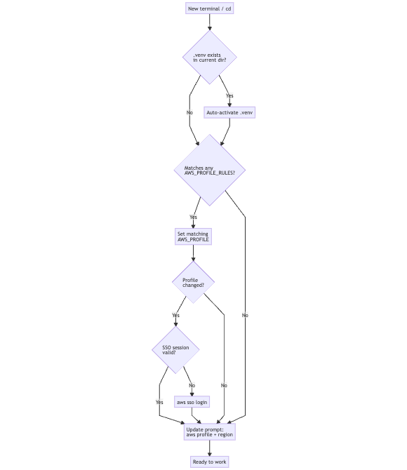
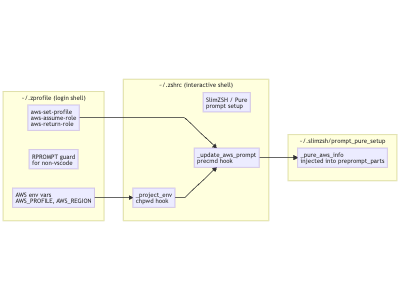

# Your Terminal Knows Which AWS Account You're In (And It Can Save You From Expensive Mistakes)


We've all been there. You're knee-deep in a Terraform plan, confident you're in UAT, and then you hit apply. Silence. Then the Slack message from your colleague: *"Did you just nuke the production database?"*

No? Just me? Either way — this article is about making sure that never happens. We're going to build a shell prompt that constantly reminds you which AWS account and region you're working in, auto-activates your Python virtual environments, and even switches AWS profiles automatically when you `cd` into the right project. All of this without slowing your terminal down.

By the end, your prompt will look like this:

```
~/git/your-repo/environments/uat feat/branch-name* dev@aws-account-name-uat @eu-north-1
.venv ❯
```

But with colors... and that little `dev@aws-account-name-uat @eu-north-1` is your safety net.

---

## What We're Building

Here's the big picture of what happens every time you open a terminal or `cd` into a directory:



Three problems, solved in one hook.

---

## Prerequisites

- macOS with [Homebrew](https://brew.sh)
- [zsh](https://www.zsh.org/) as your shell (default on macOS since Catalina)
- [AWS CLI v2](https://docs.aws.amazon.com/cli/latest/userguide/getting-started-install.html) installed and configured
- AWS SSO set up (see article in this series [02. Using VSCode for CLI and Python tasks on AWS - part 2](../02.%20Easier%20access%20to%20your%20accounts%20with%20IAM%20Identity%20Center/README.md) if you haven't done this yet)
- A coffee ☕️. This is a multi-file setup.

---

## Step 1: Pick a Prompt — Meet Pure

The foundation of a great terminal experience on zsh is [Pure](https://github.com/sindresorhus/pure) — a minimal, fast, and async prompt by Sindre Sorhus. It shows your path, git branch, dirty status, and execution time out of the box. We'll extend it with AWS awareness.

The easiest way to get Pure is through [SlimZSH](https://github.com/changs/slimzsh), which bundles it with sane defaults:

```bash
git clone --recursive https://github.com/changs/slimzsh.git ~/.slimzsh
```

Then add this to the **top** of your `~/.zshrc`:

```bash
source "$HOME/.slimzsh/slim.zsh"
```

Restart your terminal. You should now have a clean, minimal prompt. This is your canvas.

---

## Step 2: Fix VS Code Terminal Integration (Don't Skip This)

If you're using VS Code's integrated terminal — and you probably are — there's a known gotcha. If your prompt makes subprocess calls (like calling `aws configure get region` on every render), VS Code's shell integration breaks. Agent-based tools, tasks, and terminal output parsing all start misbehaving.

The fix is simple: wrap anything that modifies the prompt in a VS Code guard.

In `~/.zprofile`, set your default AWS environment variables at the top:

```bash
export AWS_PROFILE=Admin@Bootcamp
export AWS_REGION=us-east-1
export AWS_DEFAULT_REGION=us-east-1
```

Then wrap anything, which is modyfying the prompt (like `RPROMPT`), in this check:

```bash
if [[ "$TERM_PROGRAM" != "vscode" ]]; then
  setopt PROMPT_SUBST
  # ... RPROMPT setup here (for iTerm2/Terminal.app)
  export RPROMPT='$(print_aws_profile)'
else
  export RPROMPT=''
fi
```

If you are not yet applying prompt customization, you'll notice your `~/.zshrc` already has this pattern for iTerm2 shell integration:

```bash
if [[ "$TERM_PROGRAM" != "vscode" ]]; then
  test -e "${HOME}/.iterm2_shell_integration.zsh" && source "${HOME}/.iterm2_shell_integration.zsh"
fi
```

Same idea. Keep VS Code happy.

---

## Step 3: Embed AWS Info Directly in the Pure Prompt

Instead of using `RPROMPT` and similar solutions (which bleeds into terminal output and causes the VS Code issues above), we inject AWS info directly into Pure's first-line prompt — right before the execution time.

Open `~/.slimzsh/prompt_pure_setup` and find the execution time line:

```bash
# Execution time.
[[ -n $prompt_pure_cmd_exec_time ]] && preprompt_parts+=('%F{$prompt_pure_colors[execution_time]}${prompt_pure_cmd_exec_time}%f')
```

Add these two lines **before** it:

```bash
# AWS profile / assumed role (set via $_pure_aws_info in .zshrc).
[[ -n $_pure_aws_info ]] && preprompt_parts+=('${_pure_aws_info}')

# Execution time.
[[ -n $prompt_pure_cmd_exec_time ]] && preprompt_parts+=('%F{$prompt_pure_colors[execution_time]}${prompt_pure_cmd_exec_time}%f')
```

That's it for Pure. The `$_pure_aws_info` variable is a string we'll manage from `.zshrc` — no subprocess, no delay.

---

## Step 4: The AWS Prompt Hook

Now we wire it up. Add this to your `~/.zshrc`:

```bash
function _update_aws_prompt() {
  if [[ -n "$ASSUMED_ROLE" ]]; then
    # Red for assumed roles — this is important to notice at a glance
    _pure_aws_info="%F{red}${ASSUMED_ROLE}%f"
  elif [[ -n "$AWS_PROFILE" ]]; then
    local region="${AWS_DEFAULT_REGION:-$AWS_REGION}"
    _pure_aws_info="%F{blue}${AWS_PROFILE}%f"
    [[ -n "$region" ]] && _pure_aws_info+=" %F{242}@${region}%f"
  else
    _pure_aws_info=""
  fi
}
add-zsh-hook precmd _update_aws_prompt
_update_aws_prompt  # Set on shell start
```

This runs on every prompt render but reads only environment variables — it never calls `aws` or any external process. Zero latency.

The result:
- Normal profile → `admin@dwh-prod @eu-north-1` in blue
- Assumed role → the full role ARN in red (hard to miss)
- No profile → nothing shown

---

## Step 5: Auto-activate `.venv` and Switch AWS Profiles Per Project

Here's where the setup becomes genuinely useful for day-to-day work. Instead of remembering to `source .venv/bin/activate` and `aws-set-profile` every time you open a project, let the shell do it.

The key is a configurable rule table. Each entry maps a path glob to an AWS profile, evaluated from top to bottom — first match wins, so put the most specific rules first:

```bash
# AWS profile rules — most specific patterns first, first match wins.
# Format: "glob-pattern:aws-profile"
# A rule matches if $PWD equals the pattern OR is a subdirectory of it.
# Glob characters (* ? []) are supported.
AWS_PROFILE_RULES=(
  "*/sf-infra-*/environments/prod:admin@dwh-prod-strict"
  "*/sf-infra-*:admin@dwh-prod"
  "*/your-repo/environments/prod:dev@aws-account-name-prod"
  "*/your-repo:dev@aws-account-name-uat"
  # "*/git:dev@sandbox"  # fallback for all projects under ~/git
)
```

Then add the resolver and the hook:

```bash
autoload -Uz add-zsh-hook

function _resolve_aws_profile() {
  local dir="$1"
  for rule in "${AWS_PROFILE_RULES[@]}"; do
    local pattern="${rule%%:*}"
    local profile="${rule##*:}"
    # ${~pattern} enables glob matching of the variable's value in [[ ]]
    if [[ "$dir" == ${~pattern} || "$dir" == ${~pattern}/* ]]; then
      echo "$profile"
      return 0
    fi
  done
  return 1  # no match — keep current profile
}

function _project_env() {
  # Auto-activate .venv if one exists in the current directory
  local venv="$PWD/.venv/bin/activate"
  if [[ -f "$venv" && "$VIRTUAL_ENV" != "$PWD/.venv" ]]; then
    export VIRTUAL_ENV_DISABLE_PROMPT=12  # Pure handles the venv display
    source "$venv"
    echo "Activated .venv: $PWD/.venv"
  fi

  # Auto-set AWS profile based on AWS_PROFILE_RULES
  local matched_profile
  matched_profile=$(_resolve_aws_profile "$PWD")
  if [[ -n "$matched_profile" && "$AWS_PROFILE" != "$matched_profile" ]]; then
    export AWS_PROFILE="$matched_profile"
    export AWS_REGION=$(aws configure get region 2>/dev/null)
    export AWS_DEFAULT_REGION="$AWS_REGION"
    echo "AWS profile set to $AWS_PROFILE @ $AWS_REGION"
    # SSO check only when the profile actually switches
    if ! aws sts get-caller-identity &>/dev/null; then
      echo "SSO session expired, logging in..."
      aws sso login
    fi
  fi
}

add-zsh-hook chpwd _project_env
_project_env  # Run on shell start
```

The `chpwd` hook fires every time you change directory. Combined with `_project_env` running at shell start, your environment is always consistent with your current project. The SSO check only runs when the profile actually changes — not on every `cd` — so there's no latency hit.

A note on `VIRTUAL_ENV_DISABLE_PROMPT=12` — without this, activating a venv would add `(.venv)` to your `PS1`, and Pure would *also* show `.venv` in the prompt, giving you a redundant double label. Setting this magic number tells the activate script to stand down and let Pure handle it.

**How the rule matching works:** zsh's `[[ string == $pattern ]]` performs glob matching when the right-hand side is unquoted. The `${~pattern}` syntax forces this glob interpretation even when the value comes from a variable. So `*/sf-infra-*` correctly matches `/Users/wojtek/git/tv3/sf-infra-core` and everything inside it, while `*/sf-infra-*/environments/prod` takes precedence because it's listed first.

---

## Step 6: The AWS Helper Functions

Put these in `~/.zprofile` so they're available in all shells. They wrap the AWS CLI commands you use most when working across multiple accounts.

### Switch Profile and Log In

```bash
function aws-set-profile() {
  export AWS_PROFILE=$1
  export AWS_REGION=$(aws configure get region)
  export AWS_DEFAULT_REGION=$AWS_REGION
  echo "Switching profile to ${AWS_PROFILE} @ ${AWS_REGION}"
  aws sso login
}
```

Usage: `aws-set-profile admin@dwh-prod`

This switches your profile, picks up the configured region, and triggers SSO login. Use this when you need to manually switch between accounts.

### Assume a Role

```bash
function aws-assume-role() {
  OUT=$(aws sts assume-role --role-arn $1 --role-session-name $2)
  export AWS_ACCESS_KEY_ID=$(echo $OUT | jq -r '.Credentials.AccessKeyId')
  export AWS_SECRET_ACCESS_KEY=$(echo $OUT | jq -r '.Credentials.SecretAccessKey')
  export AWS_SESSION_TOKEN=$(echo $OUT | jq -r '.Credentials.SessionToken')
  export ASSUMED_ROLE=$1
  aws sts get-caller-identity
}
```

Usage: `aws-assume-role arn:aws:iam::123456789012:role/MyRole my-session`

When `ASSUMED_ROLE` is set, your prompt turns **red**. This is intentional — assumed roles often have elevated permissions, and you want a constant visual reminder.

### Return to Base Profile

```bash
function aws-return-role() {
  unset ASSUMED_ROLE AWS_ACCESS_KEY_ID AWS_SECRET_ACCESS_KEY AWS_SESSION_TOKEN
  aws sts get-caller-identity
}
```

Usage: `aws-return-role`

Clears the assumed role credentials and drops back to your base profile. Your prompt goes back to blue.

---

## Putting It All Together

Here's how the pieces fit across your shell config files:



The flow: `.zprofile` sets defaults and tools → `.zshrc` reacts to directory changes and updates `_pure_aws_info` → Pure renders it in the prompt.

---

## The Final Result

Open a new terminal in any `sf-infra-*` project directory:

```bash
~/git/tv3/sf-infra-core/environments/uat feat/svc_nexus_api_user* admin@dwh-prod @eu-north-1 3s
.venv ❯
```

Open one in `snowflake-scripts`:

```bash
~/git/tv3/snowflake-scripts master Admin@Bootcamp @us-east-1
.venv ❯
```

Assume a role:

```bash
~/git/tv3/sf-infra-core master arn:aws:iam::123456789012:role/MyRole
.venv ❯
```

The assumed role will be displayed in red. This red profile name is your "wait, double-check before you apply" moment. It's saved more than a few Friday afternoons.

---

## Summary

| What | Where | Why |
|---|---|---|
| Default AWS env vars | `~/.zprofile` | Set once, available everywhere |
| VS Code guard for RPROMPT | `~/.zprofile` | Keeps terminal output clean |
| `aws-set-profile`, `aws-assume-role`, `aws-return-role` | `~/.zprofile` | Reusable profile switching helpers |
| `_project_env` chpwd hook | `~/.zshrc` | Auto-activates `.venv` and AWS profile per project |
| `_update_aws_prompt` precmd hook | `~/.zshrc` | Updates `_pure_aws_info` on every prompt, zero subprocess calls |
| `_pure_aws_info` injection | `~/.slimzsh/prompt_pure_setup` | Renders AWS info inside Pure's first line |

The whole setup is about 50 lines of shell script spread across three files. In return, you get a terminal that knows where it is and tells you about it — loudly, in colour, every single time.

Stay safe out there. And always check the prompt before you `terraform apply`.
