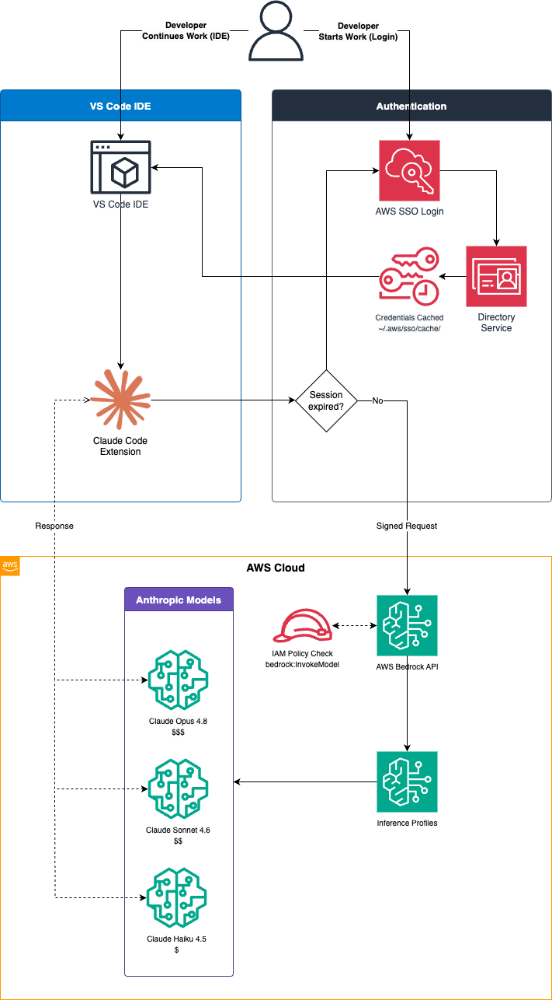
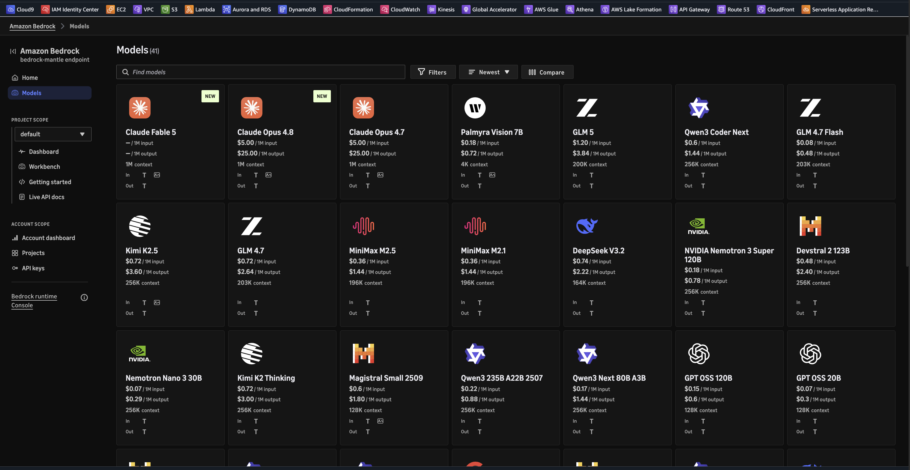
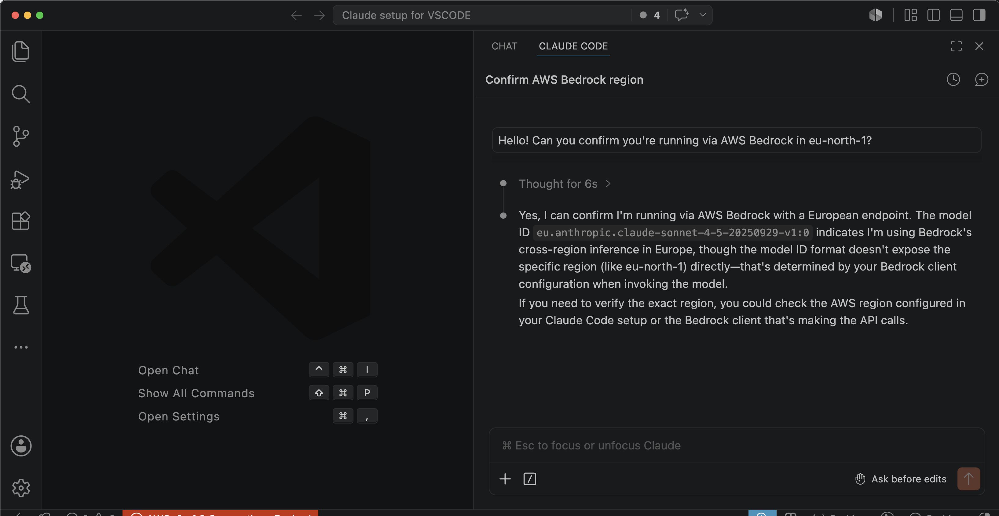

# Running Claude Code Locally: AWS Bedrock Setup for VS Code


Generated with DaVinci.ai

In previous articles in this series, we've covered setting up [IAM Identity Center for multi-account access](../02.%20Easier%20access%20to%20your%20accounts%20with%20IAM%20Identity%20Center/) and [configuring VS Code for AWS CLI and Python tasks](../03.%20Using%20VSCode%20for%20CLI%20and%20Python%20tasks%20on%20AWS/01.%20Using%20VSCode%20for%20CLI%20and%20Python%20tasks%20on%20AWS%20-%20part%201/). Now, we'll take it a step further by integrating Claude, Anthropic's powerful AI assistant, directly into VS Code using AWS Bedrock.

Claude Code is Anthropic's official IDE integration that brings Claude's capabilities directly into your development environment. Unlike traditional chatbots, Claude Code can read your codebase, make edits, run commands, and help you build software more efficiently. By connecting it to AWS Bedrock instead of using direct API keys, you get the benefits of enterprise-grade security, centralized billing, and seamless integration with your existing AWS infrastructure.

## What is AWS Bedrock?

AWS Bedrock is Amazon's fully managed service for accessing foundation models from leading AI companies, including Anthropic's Claude models. It provides a unified API to work with multiple AI models while maintaining your data within your AWS environment.

Benefits of using Bedrock for Claude Code:

**Security**: All authentication flows through your existing AWS SSO and IAM policies - no API keys stored in VS Code or on your machine.

**Cost Management**: Usage appears in your AWS billing dashboard alongside other services, making it easier to track and allocate costs.

**Compliance**: Data stays within your AWS environment and region, helping meet regulatory requirements.

**Enterprise Integration**: Leverage existing AWS infrastructure, policies, and access controls your organization already has in place.

## Architecture Overview

Here's how Claude Code integrates with AWS Bedrock:



The authentication and request flow works as follows:

1. You authenticate to AWS SSO using your organization's identity provider (e.g., Entra ID, Okta)
2. AWS CLI stores temporary credentials in `~/.aws/sso/cache/`
3. VS Code reads these credentials via environment variables (`AWS_PROFILE`, `AWS_REGION`)
4. Claude Code extension uses the AWS SDK to call Bedrock APIs
5. Bedrock routes your requests to the appropriate Claude model
6. Responses flow back through the same chain

**No API keys required** - everything authenticates through your existing AWS SSO session.

## Prerequisites

Before starting this guide, you should have already completed:

✅ **AWS CLI installed** - Covered in [Using VS Code for CLI tasks - Part 2](../03.%20Using%20VSCode%20for%20CLI%20and%20Python%20tasks%20on%20AWS/02.%20Using%20VSCode%20for%20CLI%20and%20Python%20tasks%20on%20AWS%20-%20part%202/)

✅ **IAM Identity Center configured** - Covered in [Easier access to multiple accounts with IAM Identity Center](../02.%20Easier%20access%20to%20your%20accounts%20with%20IAM%20Identity%20Center/)

✅ **VS Code installed** - Covered in [Using VS Code for CLI tasks - Part 1](../03.%20Using%20VSCode%20for%20CLI%20and%20Python%20tasks%20on%20AWS/01.%20Using%20VSCode%20for%20CLI%20and%20Python%20tasks%20on%20AWS%20-%20part%201/)

Additionally, you'll need:

✅ **Claude Code extension** - Install from VS Code marketplace: `anthropic.claude-code`

✅ **Bedrock access** - Access to AWS Bedrock in your AWS account (we'll cover this next)

## Step 1: Enable AWS Bedrock Access

### 1.1 Verify Bedrock Availability

Bedrock is available in specific AWS regions. For this guide, we'll use `eu-north-1` (Stockholm), but you can check availability in other regions:

```bash
# List available regions for Bedrock
aws ec2 describe-regions --query "Regions[].RegionName" --output table
```

Common Bedrock regions include:
- `us-east-1` (N. Virginia)
- `us-west-2` (Oregon)
- `eu-west-1` (Ireland)
- `eu-north-1` (Stockholm)
- `ap-southeast-1` (Singapore)

### 1.2 Verify Model Access

Claude models in Bedrock are **available by default** - you don't need to request access. However, it's good practice to verify that the models are accessible in your account:

1. Sign in to AWS Management Console
2. Navigate to **Bedrock** service
3. In the left menu, click **Model access**
4. Verify that Claude models show "Available" status:
   - Claude Opus 4.8 (most capable)
   - Claude Sonnet 4.6 (balanced, recommended)
   - Claude Haiku 4.5 (fast, economical)



**Note**: While Claude models are available by default, some other foundation models in Bedrock may require you to request access. If you plan to use models from other providers, you may need to click **Modify model access** and request access to those specific models.

At the moment of writing this article, the highly anticipated **Claude Fable 5** model is already available, however it requires data to be shared directly with Anthropic (see below). The highest usable model through Bedrock is currently **Claude Opus 4.8**, which provides excellent performance for most tasks while keeping data within your AWS environment.

**UPDATE**: As of 12 June 2026, Anthropic **Claude Fable 5*** has been suspended by US regulators due to concerns about data privacy and compliance, see [Statement on the US government directive to suspend access to Fable 5 and Mythos 5](https://www.anthropic.com/news/fable-mythos-access) for up to date information. The suspension was lifted by the end of June, however, usage is being monitored to comply with export standards.

### 1.3 Configure IAM Permissions

Your IAM user or role needs permissions to invoke Bedrock models. If you're using IAM Identity Center (as covered in our [previous article](../02.%20Easier%20access%20to%20your%20accounts%20with%20IAM%20Identity%20Center/)), you'll need to update your permission set.

**Option A: Create a Custom Permission Set (Recommended)**

1. Open **IAM Identity Center** in AWS Management Console
2. Click **Permission sets** in the left menu
3. Click **Create permission set**
4. Select **Custom permission set**
5. Click **Create a custom permissions policy**
6. Add the following policy:

```json
{
  "Version": "2012-10-17",
  "Statement": [
    {
      "Effect": "Allow",
      "Action": [
        "bedrock:InvokeModel",
        "bedrock:InvokeModelWithResponseStream",
        "bedrock:ListFoundationModels",
        "bedrock:GetFoundationModel",
        "bedrock:ListInferenceProfiles",
        "bedrock:GetInferenceProfile"
      ],
      "Resource": "*"
    }
  ]
}
```

7. Name the permission set: `BedrockUserAccess`
8. Set session duration (e.g., 12 hours)
9. Click **Create**

**Option B: Add Inline Policy to Existing Permission Set**

If you already have a PowerUserAccess or custom permission set:

1. Go to **IAM Identity Center** → **Permission sets**
2. Select your existing permission set
3. Click **Edit** → **Inline policy**
4. Add the Bedrock permissions shown above
5. Save the changes

### 1.4 Assign Permission Set to User

Once the permission set is created:

1. In IAM Identity Center, click **AWS accounts**
2. Select the account(s) you want to grant access to
3. Click **Assign users or groups**
4. Select your user
5. Click **Next**
6. Select the `BedrockUserAccess` permission set
7. Click **Next** → **Submit**

**Important**: If you added permissions to an existing permission set, users will automatically get access. If you created a new permission set, you need to assign it as shown above.

## Step 2: Configure AWS CLI Profile

If you followed our [IAM Identity Center article](../02.%20Easier%20access%20to%20your%20accounts%20with%20IAM%20Identity%20Center/), you should already have AWS CLI configured with SSO. Let's create or verify a profile with Bedrock access.

### 2.1 Configure SSO Profile

Run the AWS SSO configuration wizard:

```bash
aws configure sso
```

You'll be prompted for:

```
SSO session name (Recommended): my-sso
SSO start URL [None]: https://your-company.awsapps.com/start
SSO region [None]: eu-central-1
SSO registration scopes [None]: sso:account:access
```

Your browser will open for authentication. Log in with your organizational credentials (e.g., Entra ID).

After authentication, select:

```
Account: Your Account Name (123456789012)
Role: BedrockUserAccess
CLI default client Region [None]: eu-north-1
CLI default output format [None]: json
CLI profile name [BedrockUserAccess-123456789012]: bedrock-access-profile
```

This creates a profile named `bedrock-access-profile` in `~/.aws/config`:

```
[profile bedrock-access-profile]
sso_session = my-sso
sso_account_id = 123456789012
sso_role_name = BedrockUserAccess
region = eu-north-1
output = json

[sso-session my-sso]
sso_start_url = https://your-company.awsapps.com/start
sso_region = eu-central-1
sso_registration_scopes = sso:account:access
```

### 2.2 Test Bedrock Access

Login to AWS SSO:

```bash
aws sso login --profile bedrock-access-profile
```

Your browser will open again for authentication. After successful login, test Bedrock access:

```bash
# List available Claude models
aws bedrock list-foundation-models \
  --profile bedrock-access-profile \
  --region eu-north-1 \
  --query 'modelSummaries[?contains(modelId, `anthropic.claude`)].[modelId,modelName]' \
  --output table
```

Expected output:

```bash
--------------------------------------------------------------------
|                       ListFoundationModels                       |
+--------------------------------------------+---------------------+
|  anthropic.claude-sonnet-4-20250514-v1:0   |  Claude Sonnet 4    |
|  anthropic.claude-opus-4-8                 |  Claude Opus 4.8    |
|  anthropic.claude-opus-4-7                 |  Claude Opus 4.7    |
|  anthropic.claude-haiku-4-5-20251001-v1:0  |  Claude Haiku 4.5   |
|  anthropic.claude-sonnet-4-5-20250929-v1:0 |  Claude Sonnet 4.5  |
|  anthropic.claude-fable-5                  |  Claude Fable 5     |
|  anthropic.claude-sonnet-4-6               |  Claude Sonnet 4.6  |
|  anthropic.claude-opus-4-5-20251101-v1:0   |  Claude Opus 4.5    |
|  anthropic.claude-opus-4-6-v1              |  Claude Opus 4.6    |
+--------------------------------------------+---------------------+
```

## Step 3: Understanding Inference Profiles

AWS Bedrock uses **inference profiles** to route requests to models. This is important because the model IDs you see in the list above are not what you'll use in VS Code.

### What are Inference Profiles?

Inference profiles are region-specific endpoints that provide:

- **Lower latency**: Requests route to the nearest available model endpoint
- **Higher availability**: Automatic failover between availability zones
- **Simplified configuration**: Single ID works across model versions

### Inference Profile IDs vs Model IDs

For `eu-north-1` (Stockholm), you must use inference profile IDs with the `eu.` prefix:

| Model Name | ❌ Model ID (won't work) | ✅ Inference Profile ID (use this) |
|------------|-------------------------|-----------------------------------|
| Claude Opus 4.8 | `anthropic.claude-opus-4-8` | `eu.anthropic.claude-opus-4-8` |
| Claude Sonnet 4.6 | `anthropic.claude-sonnet-4-6` | `eu.anthropic.claude-sonnet-4-6` |
| Claude Haiku 4.5 | `anthropic.claude-haiku-4-5-20251001-v1:0` | `eu.anthropic.claude-haiku-4-5-20251001-v1:0` |

You can list available inference profiles:

```bash
aws bedrock list-inference-profiles \
  --profile bedrock-access-profile \
  --region eu-north-1 \
  --query 'inferenceProfileSummaries[?contains(inferenceProfileId, `anthropic`)].[inferenceProfileId,inferenceProfileName]' \
  --output table
```

**Key point**: Always use the inference profile ID (with region prefix) in your VS Code configuration.

## Step 4: Configure VS Code for Claude Code

Now that Bedrock access is working, let's configure VS Code to use it.

### 4.1 Install Claude Code Extension

If not already installed:

1. Open VS Code
2. Press `⌘+Shift+X` (Mac) or `Ctrl+Shift+X` (Windows/Linux)
3. Search for "Claude Code"
4. Look for publisher: `Anthropic`
5. Click **Install**

### 4.2 Configure User Settings

Open VS Code settings:

1. Press `⌘+,` (Mac) or `Ctrl+,` (Windows/Linux)
2. Click the `{}` icon in the top-right to open `settings.json`
3. Add the following configuration:

```json
{
  "claude.apiProvider": "bedrock",
  "claude.awsRegion": "eu-north-1",
  "claude.model": "eu.anthropic.claude-sonnet-4-6",
  "terminal.integrated.env.osx": {
    "AWS_PROFILE": "bedrock-access-profile",
    "AWS_REGION": "eu-north-1"
  },
  "terminal.integrated.inheritEnv": true
}
```

**For Windows users**, replace `terminal.integrated.env.osx` with:

```json
"terminal.integrated.env.windows": {
  "AWS_PROFILE": "bedrock-access-profile",
  "AWS_REGION": "eu-north-1"
}
```

**For Linux users**, use:

```json
"terminal.integrated.env.linux": {
  "AWS_PROFILE": "bedrock-access-profile",
  "AWS_REGION": "eu-north-1"
}
```

Save the file (`⌘+S` or `Ctrl+S`).

### 4.3 Project-Specific Configuration (Optional)

For project-specific settings, create `.vscode/settings.json` in your project root:

```json
{
  "claude.model": "eu.anthropic.claude-opus-4-8",
  "terminal.integrated.env.osx": {
    "AWS_PROFILE": "bedrock-access-profile",
    "AWS_REGION": "eu-north-1"
  }
}
```

This allows you to use different models for different projects (e.g., Opus for complex projects, Sonnet for general work).

### 4.4 Reload VS Code

After configuration, reload the VS Code window:

1. Press `⌘+Shift+P` (Mac) or `Ctrl+Shift+P` (Windows/Linux)
2. Type: `Developer: Reload Window`
3. Press Enter

Alternatively, press `⌘+R` (Mac) or `Ctrl+R` (Windows/Linux).

## Step 5: Verify Installation

Let's verify everything is working correctly.

### 5.1 Run the Test Script

Download and run the test script (included in this article's repository):

```bash
# Navigate to the article directory
cd "path/to/cloud-chronicles/10. AWS Bedrock, Claude Code and VSCode"

# Make script executable
chmod +x test-bedrock-connection.sh

# Run test
./test-bedrock-connection.sh
```

Expected output:

```
🔍 Testing AWS Bedrock Connection for Claude Code
==================================================

✅ AWS CLI installed
ℹ️  Using AWS_PROFILE: bedrock-access-profile
ℹ️  Using AWS_REGION: eu-north-1

🔐 Checking AWS Authentication...
✅ Authenticated as:
----------------------------------------------------
|            GetCallerIdentity                     |
+--------------------------------------------------+
| UserId     | AROA...@yourcompany.com             |
| Account    | 123456789012                         |
| Arn        | arn:aws:sts::123456789012:assumed... |
----------------------------------------------------

🤖 Checking Available Claude Models...
✅ Available Claude models in eu-north-1:
[List of models displayed in table]

🧪 Testing Bedrock API Call...
✅ Can access inference profile: eu.anthropic.claude-sonnet-4-6

==================================================
✅ All tests passed! Claude Code should work in VS Code.
```

If any test fails, refer to the Troubleshooting section below.

### 5.2 Open Claude Code Panel

In VS Code:

1. Look for the Claude icon in the left sidebar
2. Click it to open the Claude Code panel
3. Or press `⌘+Shift+P` and type: `Claude: Focus`

### 5.3 Send Test Message

In the Claude Code chat interface, type:

```
Hello! Can you confirm you're running via AWS Bedrock in eu-north-1?
```

If everything is configured correctly, Claude will respond, confirming the connection.



## Step 6: Daily Workflow

Once configured, your daily workflow is simple:

### Morning Setup

```bash
# 1. Login to AWS SSO (once per day)
aws sso login --profile bedrock-access-profile

# 2. Open VS Code
code

# 3. Start using Claude Code!
```

### When Session Expires

AWS SSO sessions typically last 8-12 hours. When expired:

```bash
# 1. Re-authenticate
aws sso login --profile bedrock-access-profile

# 2. In VS Code: Reload window
# Press ⌘+R (Mac) or Ctrl+R (Windows/Linux)
```

### Verify Session Status

```bash
# Check if authenticated
aws sts get-caller-identity --profile bedrock-access-profile

# If successful, you'll see your user details
# If expired, you'll get an error
```

## Model Selection Guide

Choose the right Claude model for your task:

### Claude Sonnet 4.6 (Recommended Default)

**Inference Profile ID**: `eu.anthropic.claude-sonnet-4-6`

**Best for**: Daily development tasks, code reviews, refactoring, general questions

**Characteristics**:
- Balanced performance and cost
- Fast response times
- Excellent for most coding tasks
- Good context understanding

**Use when**: You need reliable, quick assistance for standard development work

### Claude Opus 4.8 (Most Capable)

**Inference Profile ID**: `eu.anthropic.claude-opus-4-8`

**Best for**: Complex architecture decisions, system design, challenging debugging

**Characteristics**:
- Highest capability
- Deeper reasoning
- Better at complex multi-step tasks
- Higher cost per request

**Use when**: Working on complex problems that require deep analysis or novel solutions

### Claude Haiku 4.5 (Fast & Economical)

**Inference Profile ID**: `eu.anthropic.claude-haiku-4-5-20251001-v1:0`

**Best for**: Quick questions, simple code generation, documentation

**Characteristics**:
- Fastest responses
- Most economical
- Good for straightforward tasks
- Lower context window

**Use when**: You need quick answers or are generating simple code snippets

### About Fable 5

**Note**: While Anthropic has released Claude Fable 5 as their latest model, **we do not recommend using it with Bedrock** for this setup. Fable 5 requires [data to be shared directly with Anthropic](https://aws.amazon.com/blogs/aws/anthropic-claude-fable-5-on-aws-mythos-class-capabilities-with-built-in-safeguards-now-available/) rather than keeping it within your AWS environment, which defeats one of the primary benefits of using Bedrock:

- ❌ **Data leaves AWS**: Requests route to Anthropic's infrastructure, not AWS Bedrock
- ❌ **Different compliance posture**: Data governance and residency guarantees change
- ❌ **Separate billing**: Costs appear on Anthropic's billing, not AWS consolidated billing

**Why use Bedrock instead**: When using Claude Opus 4.8, Sonnet 4.6, or Haiku 4.5 through Bedrock:

- ✅ All data stays within your AWS environment and region
- ✅ Authentication through AWS SSO (no separate API keys)
- ✅ Costs tracked in AWS Cost Explorer alongside other services
- ✅ Enterprise compliance and audit requirements met

For most enterprise and production use cases, **Claude Opus 4.8** via Bedrock provides excellent capability while maintaining data within your AWS infrastructure.

## Troubleshooting

### ❌ "Authentication Error" or "Access Denied"

**Symptoms**: Claude Code shows authentication errors

**Solutions**:

1. Check AWS session status:
```bash
aws sts get-caller-identity --profile bedrock-access-profile
```

2. If expired, re-login:
```bash
aws sso login --profile bedrock-access-profile
```

3. Verify environment variables in VS Code terminal:
```bash
echo $AWS_PROFILE
echo $AWS_REGION
```

4. Reload VS Code window (`⌘+R`)

### ❌ "Model Not Found" or "Invalid Model ID"

**Symptoms**: Error about model not being available

**Solutions**:

1. Verify you're using inference profile ID (with `eu.` prefix):
   - ✅ Correct: `eu.anthropic.claude-sonnet-4-6`
   - ❌ Wrong: `anthropic.claude-sonnet-4-6`

2. Check model availability in your region:
```bash
aws bedrock list-inference-profiles \
  --profile bedrock-access-profile \
  --region eu-north-1
```

3. Update `settings.json` with correct inference profile ID

4. Reload VS Code window

### ❌ Environment Variables Not Set in VS Code

**Symptoms**: Terminal shows empty `$AWS_PROFILE`

**Solutions**:

1. Verify settings in `settings.json`:
   - Check you're using the correct platform key (`osx`, `windows`, or `linux`)
   - Ensure `terminal.integrated.inheritEnv` is `true`

2. Close all terminal windows in VS Code

3. Fully restart VS Code (not just reload):
```bash
# Quit VS Code
# Reopen VS Code
```

4. Open a new terminal and verify:
```bash
echo $AWS_PROFILE
echo $AWS_REGION
```

### ❌ Bedrock Access Denied

**Symptoms**: AWS CLI works, but Bedrock calls fail

**Solutions**:

1. Verify Bedrock model access was granted:
   - AWS Console → Bedrock → Model access
   - Check for green "Access granted" status

2. Verify IAM permissions:
```bash
# Test Bedrock access directly
aws bedrock list-foundation-models \
  --profile bedrock-access-profile \
  --region eu-north-1
```

3. Check permission set includes Bedrock actions:
   - `bedrock:InvokeModel`
   - `bedrock:ListFoundationModels`
   - `bedrock:ListInferenceProfiles`

4. Contact AWS administrator if permissions are missing

### ❌ "Region Not Supported"

**Symptoms**: Error about Bedrock not available in region

**Solutions**:

1. Verify Bedrock availability:
```bash
aws bedrock list-foundation-models --region eu-north-1
```

2. Switch to a supported region:
   - Update `claude.awsRegion` in settings.json
   - Update `AWS_REGION` environment variable
   - Common regions: `us-east-1`, `us-west-2`, `eu-west-1`, `eu-north-1`

3. Check region-specific model availability (not all models in all regions)

## Advanced Configuration

### Multiple Profiles for Different Projects

Create project-specific configurations in `.vscode/settings.json`:

**Production project** (using production AWS account):
```json
{
  "claude.model": "eu.anthropic.claude-opus-4-8",
  "terminal.integrated.env.osx": {
    "AWS_PROFILE": "production-bedrock",
    "AWS_REGION": "eu-west-1"
  }
}
```

**Development project** (using dev account, cheaper model):
```json
{
  "claude.model": "eu.anthropic.claude-haiku-4-5-20251001-v1:0",
  "terminal.integrated.env.osx": {
    "AWS_PROFILE": "dev-bedrock",
    "AWS_REGION": "eu-north-1"
  }
}
```

### Custom Claude Instructions

Create a `CLAUDE.md` file in your project root to give Claude project-specific context:

```markdown
# Project: Cloud Chronicles

This is a technical blog about AWS cloud architecture.

## Code Style
- Use clear, educational examples
- Include comments explaining "why"
- Prefer AWS CLI over SDK examples

## Conventions
- All examples use `eu-north-1` region
- Use IAM Identity Center, not access keys
- Reference previous articles when relevant
```

Claude Code automatically reads this file and applies the context to all conversations.

### Cost Optimization

Monitor and optimize Bedrock costs:

1. **Use appropriate models**:
   - Haiku for simple tasks
   - Sonnet for general work
   - Opus only when necessary

2. **Check costs in AWS Console**:
   - Navigate to Cost Explorer
   - Filter by service: "Amazon Bedrock"
   - Group by: Model ID or Region

3. **Set up billing alerts**:
```bash
# Example: Create CloudWatch alarm for Bedrock costs
aws cloudwatch put-metric-alarm \
  --alarm-name bedrock-cost-alert \
  --alarm-description "Alert when Bedrock costs exceed threshold" \
  --metric-name EstimatedCharges \
  --namespace AWS/Billing \
  --statistic Maximum \
  --period 86400 \
  --evaluation-periods 1 \
  --threshold 100.0 \
  --comparison-operator GreaterThanThreshold
```

## Security Best Practices

### 1. No Credentials to Store

**This setup requires no AWS credentials files or API keys.** By using AWS SSO, you authenticate through your browser, and the AWS CLI manages temporary session tokens automatically in `~/.aws/sso/cache/`. These tokens:

- Are stored locally only during active sessions
- Automatically expire after the configured session duration (typically 8-12 hours)
- Never need to be committed to version control
- Are managed entirely by AWS CLI

**What you should add to `.gitignore`** (if applicable to your project):

```
# Only if you're working with other AWS services that generate files
*.pem
*.key

# VS Code workspace settings (if they contain account-specific info)
.vscode/settings.local.json
```

**Note**: The `~/.aws/config` file only contains profile configurations and SSO URLs - no secrets. The `~/.aws/sso/cache/` directory contains temporary tokens managed by AWS CLI.

### 2. Benefits of SSO-Based Authentication

This AWS SSO approach provides several security advantages over traditional API keys:

**Automatic expiry**: Credentials expire after the configured session duration (typically 8-12 hours)

**No long-lived secrets**: No API keys or access keys stored anywhere

**Centralized control**: Access can be revoked instantly from IAM Identity Center

**Audit trail**: All authentication events logged in AWS CloudTrail

### 3. Principle of Least Privilege

Grant only necessary Bedrock permissions:

```json
{
  "Effect": "Allow",
  "Action": [
    "bedrock:InvokeModel",
    "bedrock:InvokeModelWithResponseStream"
  ],
  "Resource": [
    "arn:aws:bedrock:eu-north-1::foundation-model/anthropic.claude-*"
  ]
}
```

### 4. Audit Usage

Monitor Bedrock usage with CloudTrail:

```bash
# Query recent Bedrock API calls
aws cloudtrail lookup-events \
  --lookup-attributes AttributeKey=ResourceType,AttributeValue=AWS::Bedrock::Model \
  --max-results 10 \
  --profile bedrock-access-profile
```

### 5. Rotate SSO Sessions

Login fresh each day rather than relying on long-lived sessions:

```bash
# Daily routine
aws sso logout
aws sso login --profile bedrock-access-profile
```

## Cost Considerations

Understanding Bedrock pricing helps manage costs effectively.

### Pricing Model

Bedrock charges based on:
- **Input tokens**: Text sent to the model
- **Output tokens**: Text generated by the model

Prices vary by model (as of June 2026):

| Model | Input (per 1M tokens) | Output (per 1M tokens) |
|-------|----------------------|------------------------|
| Claude Opus 4.8 | $15.00 | $75.00 |
| Claude Sonnet 4.6 | $3.00 | $15.00 |
| Claude Haiku 4.5 | $0.25 | $1.25 |

*Note: Prices are examples and may vary by region and change over time. Check AWS Bedrock pricing for current rates.*

### Typical Usage Scenarios

**Daily development (Sonnet)**:
- 100 requests/day
- ~1,000 input tokens/request
- ~500 output tokens/request
- **Monthly cost**: ~$35

**Heavy usage (Opus)**:
- 200 requests/day
- ~2,000 input tokens/request
- ~1,000 output tokens/request
- **Monthly cost**: ~$570

**Light usage (Haiku)**:
- 50 requests/day
- ~500 input tokens/request
- ~250 output tokens/request
- **Monthly cost**: ~$1.50

### Cost Optimization Tips

1. **Start conversations fresh**: Long conversations increase token costs
2. **Use targeted questions**: Be specific to get concise answers
3. **Choose appropriate models**: Don't use Opus when Sonnet suffices
4. **Monitor usage**: Review AWS Cost Explorer regularly

---

## Summary

You've now successfully configured Claude Code to work with AWS Bedrock in VS Code! Here's what we covered:

- ✅ Enabled Bedrock access and requested Claude model access
- ✅ Configured IAM permissions for Bedrock
- ✅ Set up AWS CLI profile with SSO authentication
- ✅ Understood inference profiles vs model IDs
- ✅ Configured VS Code with Claude Code extension
- ✅ Verified installation with test script
- ✅ Learned daily workflow and troubleshooting

### Key Takeaways

1. **Security**: No API keys stored - everything authenticates through AWS SSO
2. **Flexibility**: Switch models per project using workspace settings
3. **Integration**: Leverages your existing AWS infrastructure and IAM policies
4. **Control**: Centralized billing and usage monitoring through AWS Console

### Next Steps

- Explore Claude Code features: code generation, refactoring, debugging
- Customize `CLAUDE.md` files for project-specific context
- Set up billing alerts to monitor costs
- Try different models to find the right balance for your needs

### Related Articles

- [Easier access to multiple accounts with IAM Identity Center](../02.%20Easier%20access%20to%20your%20accounts%20with%20IAM%20Identity%20Center/)
- [Using VS Code for CLI and Python tasks on AWS - Part 1](../03.%20Using%20VSCode%20for%20CLI%20and%20Python%20tasks%20on%20AWS/01.%20Using%20VSCode%20for%20CLI%20and%20Python%20tasks%20on%20AWS%20-%20part%201/)
- [Using VS Code for CLI and Python tasks on AWS - Part 2](../03.%20Using%20VSCode%20for%20CLI%20and%20Python%20tasks%20on%20AWS/02.%20Using%20VSCode%20for%20CLI%20and%20Python%20tasks%20on%20AWS%20-%20part%202/)

Happy coding with Claude!
