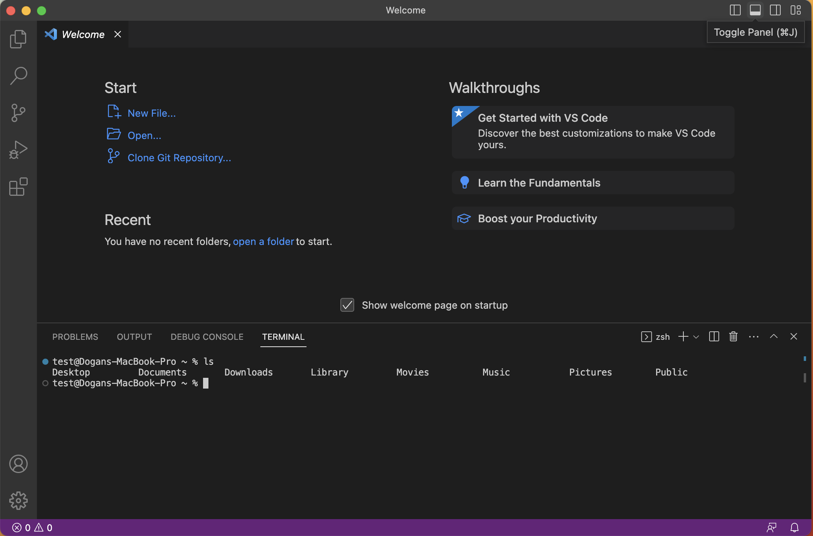

# Using VSCode for CLI and Python tasks on AWS - part 1


As part of my upgrade path, I have taken the [Cloud Mastery Bootcamp](https://digitalcloud.training/cloud-mastery-bootcamp) course from [Digital Cloud Training](https://digitalcloud.training/). The company I work with is migrating the Over The Top (OTT) video service to the AWS cloud and being the solution architect of the OTT service I needed to refresh my knowledge and upgrade my cloud skills.

The course is great and includes the AWS Solution Architecture topics, DevOps, Infrastructure as a Code, as well as elements of Linux and Python. In the Python class, we are using the Cloud9 IDE as it is easier to have everyone in a pre-configured environment. Cloud9 is a great AWS IDE, which runs on an EC2 instance in the AWS cloud.

I like it, but I like the Visual Studio Code (a.k.a. VSCode) more. Especially since it is free and runs locally, not on EC2 through the browser window. I decided to ask ChatGPT to help me to write this article, which explains step by step how to get a local environment equivalent to the AWS Cloud9 IDE allowing access to AWS resources using Python and CLI. It should allow to:

1. VSCode IDE - the core of the development environment providing the code editing and the terminal window
2. AWS extension - allowing direct access to AWS resources from VSCode
3. Python3 - Python interpreter
4. Boto3 - The library allowing access to AWS resources from Python
5. AWS CLI - allowing access to AWS resources from the command prompt
6. Of course the Chat GPT extension for VSCode
7. An extra tool allows assuming the roles from CLI, which I will reveal at the end of this article

If you are not sure about the above tools, I will provide some explanations and use cases together with the installation steps below.

As I'm working on my MacBook, I needed ChatGPT to help me with the information what are the equivalent steps for Ubuntu Linux and Windows. I hope they are not wrong, although I have verified them online, as much as I could, I might be wrong in some steps. Let me know.

Here are the instructions to set up Python3 and VSCode on MacBook, Ubuntu Linux, and Windows PC, and configure it to allow access to AWS resources from the CLI in the VSCode terminal and Python scripts:

## Python3

Python is a popular language for developing applications and scripts for use on the AWS platform. There are several ways in which Python can be used with AWS, including:

Writing AWS Lambda functions: AWS Lambda is a serverless computing service that allows you to run code without provisioning or managing servers. Python is a popular language for developing Lambda functions, which can be triggered by events in other AWS services, such as S3, DynamoDB, and Kinesis.


Developing AWS applications: Python can be used to develop applications that interact with AWS services, such as the AWS SDK for Python (boto3). This allows you to create custom solutions for your specific needs, whether you're building a web application, data pipeline, or machine learning model.

Automating AWS tasks: Python scripts can be used to automate tasks on AWS, such as creating and managing EC2 instances, managing S3 buckets, and managing IAM users and roles. This can help to streamline your workflow and reduce the amount of manual intervention required.

Integrating with AWS services: Python can be integrated with other AWS services, such as Amazon SageMaker, to build and deploy machine learning models. Python can also be used with AWS IoT to build applications that interact with IoT devices, and with AWS Glue to perform ETL (extract, transform, load) operations on data stored in AWS.

### Install Python3 on macOS

Macbooks are shipped with pre-installed Python 2.x while we need version 3.x to work with AWS. Currently, AWS supports Python 3.7-3.9 and we will install version 3.9 as the most current from those supported by AWS. You can verify what version you have installed by opening Terminal and running the command:

```sh
$ python --version
Python 3.9.16
```

If you see this, you are lucky, but if you did not update your Python version you probably will see:

```sh
$ python3 --version
sh: python3: command not found
```

In case the version is not 3.x, you need to install Python 3. I'm not going to repeat the steps, which are greatly presented here: https://docs.python-guide.org/starting/install3/osx/.

### Install Python3 on Ubuntu

In the case of Ubuntu, it is simple, just open the Terminal and run:

```sh
sudo apt update
sudo apt install python3
```

### Install Python3 on Windows

Download the latest Python3 installer from the official website: https://www.python.org/downloads/windows/ and run the installer. Make sure to select "Add Python 3. x to PATH" during the installation process.

## VSCode

Visual Studio Code (VSCode) is a free and open-source code editor developed by Microsoft. It is available on multiple platforms, including Windows, macOS, and Linux, and is designed to be lightweight and customizable. VSCode has several features that make it popular among developers, including support for syntax highlighting, code completion, debugging, Git integration, and a wide range of extensions that can be used to customize and extend its functionality.


It is also highly configurable, with a wide range of settings that can be adjusted to suit individual preferences and workflows. VSCode can be a very useful tool for AWS developers in the following ways:

AWS extensions: There are many extensions available for VSCode that are specifically designed to work with AWS services. For example, the AWS Toolkit for VSCode provides an integrated development environment (IDE) experience for developing serverless applications on AWS, including support for AWS Lambda, AWS SAM, and AWS CloudFormation.

Debugging: VSCode has a powerful built-in debugger that can be used to debug AWS applications running locally or in the cloud. This can be especially helpful for debugging Lambda functions or other serverless applications.

Git integration: VSCode has built-in Git integration that can be used to manage source code and deploy AWS applications using version control. This can help to streamline the development process and ensure that changes are tracked and managed effectively.

Terminal integration: VSCode has a built-in terminal that can be used to interact with the AWS CLI, run scripts, and execute commands. This can be especially helpful for managing AWS resources and running tests.

Customization: VSCode is highly customizable, with a wide range of settings and extensions that can be used to tailor the environment to suit individual preferences and workflows. This can help to improve productivity and make working with AWS more efficient.

### Install VSCode

Download the appropriate installer for your OS from the official website: https://code.visualstudio.com/download and install VSCode by following the instructions for your OS.

Finally, launch VSCode.

Open the terminal (Command Prompt on Windows) in VSCode by selecting _Terminal_ -> _New Terminal_ from the menu.


Now we are already aligned between the system and we have the same terminal running on each, although still there will be differences between available commands, which depend on the shell, which is available on your machine. The good thing is that the AWS CLI will be common between our three platforms.

You should see the terminal window and the prompt at the bottom of the VSCode window.



Let's test it. Run _python3_ in the terminal window, you should see the following:

```sh
$ python3
Python 3.9.16 (main, Dec  7 2022, 10:16:11) 
[Clang 14.0.0 (clang-1400.0.29.202)] on darwin
Type "help", "copyright", "credits" or "license" for more information.
>>> 
```

You can exit by typing _quit()_. Now let's install AWS tools.

---

By now we have installed the Python interpreter and the Visual Studio Code IDE. Let's continue in the second part of this article [Using VSCode for CLI and Python tasks on AWS - part 2](../02.%20Using%20VSCode%20for%20CLI%20and%20Python%20tasks%20on%20AWS%20-%20part%202/README.md), where we will cover AWS CLI and Boto3 library installation.
