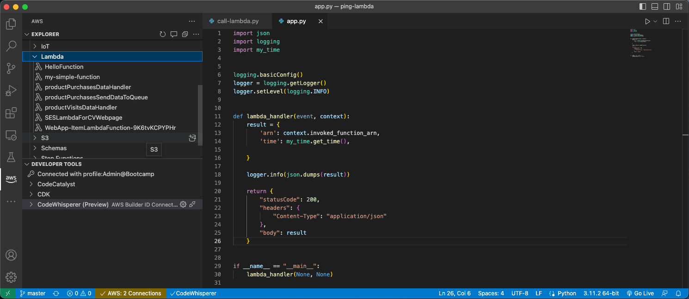

# Using VSCode for CLI and Python tasks on AWS




## AWS CLI

The AWS CLI (Command Line Interface) is a powerful tool for managing your AWS resources and services through a command-line interface. It allows you to interact with AWS resources using commands in your terminal (or Command Prompt on Windows) rather than using the AWS Management Console or SDK.

The AWS CLI can be useful in a variety of scenarios, including:

Automating repetitive tasks: If you have to perform the same AWS-related tasks regularly, you can use the AWS CLI to automate these tasks by writing scripts that perform the required actions.

Developing and testing applications: Developers can use the AWS CLI to test and deploy their applications using scripts or automation tools. This can help streamline the development and deployment process.

Managing AWS resources in a serverless environment: The AWS CLI is especially useful for managing AWS resources in a serverless environment, where you might be creating and deploying Lambda functions, API Gateway, S3 buckets, and other serverless components using the AWS CLI.

Managing AWS resources across multiple accounts and regions: With the AWS CLI, you can manage AWS resources across multiple accounts and regions using a single tool, making it easy to automate and manage complex AWS environments.

Integrating with other tools and services: The AWS CLI can be integrated with other tools and services, such as Jenkins, Git, and Docker, to automate the deployment and management of AWS resources in these environments.

### Install AWS CLI on macOS

If you have _sudo_ permissions, you can install the AWS CLI for all users on the computer:

```sh
curl "https://awscli.amazonaws.com/AWSCLIV2.pkg" -o "AWSCLIV2.pkg"
sudo installer -pkg AWSCLIV2.pkg -target /
```

In case you are not able to do this, you can follow the instructions from AWS: https://docs.aws.amazon.com/cli/latest/userguide/getting-started-install.html.

### Install AWS CLI on Ubuntu

Just run:

```sh
sudo apt install awscli
```

### Install AWS CLI on Windows

Download the MSI installer from the official website: https://aws.amazon.com/cli/ and run the installer. Make sure to select "Add Python to environment variables" during the installation process.

## Configure AWS access

Before we can use AWS CLI we need to set up the necessary configuration settings to communicate with the AWS services. Specifically, we need to configure the _access key ID_ and _secret access key_ that are used to authenticate requests to AWS services, as well as the default region and output format to be used when interacting with AWS services.

Without configuring the AWS CLI, we would not be able to interact with AWS services. The AWS CLI would not have any rights to AWS resources.

> It's important to note that the access key ID and secret access key are sensitive information that should be kept secure. We should only give access to AWS resources to individuals or applications that require it and remove access when it is no longer needed.

Following are the steps to get the  _access key ID_ and _secret access key_:

1. Log in to the AWS Management Console using your AWS account credentials.
1. Open the IAM console.
1. In the navigation pane, choose "Users".
1. Select your IAM user name.
1. Choose the "Security credentials" tab.
1. Expand the "Access keys" section.
1. Choose "Create access key".
1. Download and save the access key file.
1. Use the access key ID and secret access key from the file to complete the _aws configure_ command.

> Note that you should treat your access key ID and secret access key as sensitive information and keep them secure. Do not share them with others, and rotate them regularly to ensure the security of your AWS account.

Configure the AWS CLI: Run the following command in the terminal or command prompt window: _aws configure_. This will launch a wizard that will guide you through the process of configuring the AWS CLI:

```sh
$ aws configure
AWS Access Key ID [None]: ********************
AWS Secret Access Key [None]: ********************
Default region name []: us-east-1
Default output format [None]: YAML
```

1. Enter your AWS _access key ID_ and _secret access key_: You will need to enter your access key ID and secret access key, which you can obtain from the AWS Management Console.
1. Choose your default region: You will need to choose a default region for the AWS CLI. This is the region that the CLI will use by default for all AWS services.
1. Choose your default output format: You will need to choose a default output format for the AWS CLI. This is the format that the CLI will use to display output from AWS services. You can choose between JSON and YAML or leave it empty, to let AWS decide.

Test the AWS CLI: Once the AWS CLI is configured, you can test it by running a command such as _aws s3 ls_. This will list the contents of your default S3 bucket (assuming you have one).

```sh
$ aws s3 ls
2023-04-01 19:21:39 python-session-1-dogan
```

Great, we have the development IDE and the AWS CLI installed. Now let's install the Boto3 library, so we can also talk to AWS resources from Python code.

## AWS SDK for Python (Boto3)

Boto3 is the AWS Software Development Kit (SDK) for Python, which allows developers to write Python scripts to interact with AWS services programmatically. Here are some of the main use cases for Boto3:

Automating AWS infrastructure: Boto3 can be used to automate the creation, modification, and deletion of AWS resources, such as EC2 instances, S3 buckets, and RDS databases. This can save time and reduce errors that can occur when creating and managing resources manually.

Data processing and analysis: Boto3 can be used to retrieve data from AWS services, such as S3, DynamoDB, and Kinesis, and process it using Python libraries and tools, such as NumPy and Pandas. This can be useful for performing data analysis, machine learning, and other tasks that require processing large amounts of data.

DevOps automation: Boto3 can be used to automate tasks related to DevOps, such as deploying code to AWS services using tools like CodeDeploy and CodePipeline. This can streamline the deployment process and reduce the time and effort required to deploy code to AWS.

Cloud management and monitoring: Boto3 can be used to manage and monitor AWS services, such as CloudWatch, CloudFormation, and AWS Config. This can help ensure that AWS resources are running smoothly and within expected parameters and can help identify issues before they become critical.

### Install Boto3 on macOS

On macOS, if you followed the Python installation steps from the link provided above, you will have already installed the _pip3_ package manager, so we just need to run the following command:

```sh
pip3 install boto3
```

It will install the Boto3 library.

### Install Boto3 on Ubuntu

To install Boto3 on Linux, we need to install the _pip3_ explicitly, unless you have installed it already before. In the VSCode terminal window run:

```sh
sudo apt-get install python3-pip
pip3 install boto3
```

Above code will install the _pip3_ package manager and then the Boto3 library.

### Install Boto3 on Windows

In case of Windows, the process is similar to macOS and the _pip3_ package manager should come together with python installation. Just run:

```sh
pip3 install boto3
```

